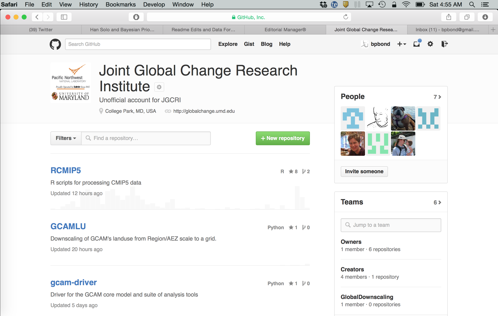
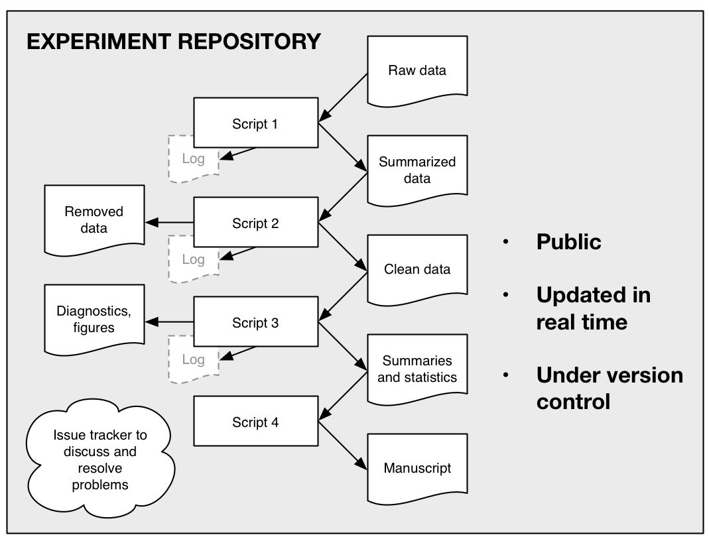
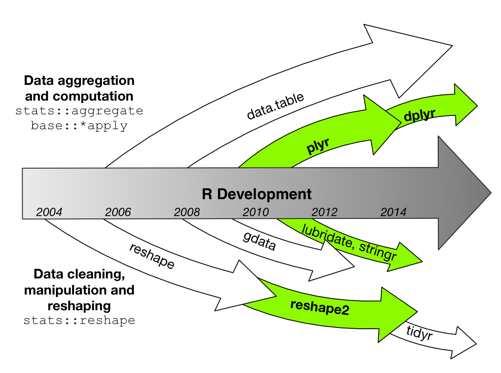
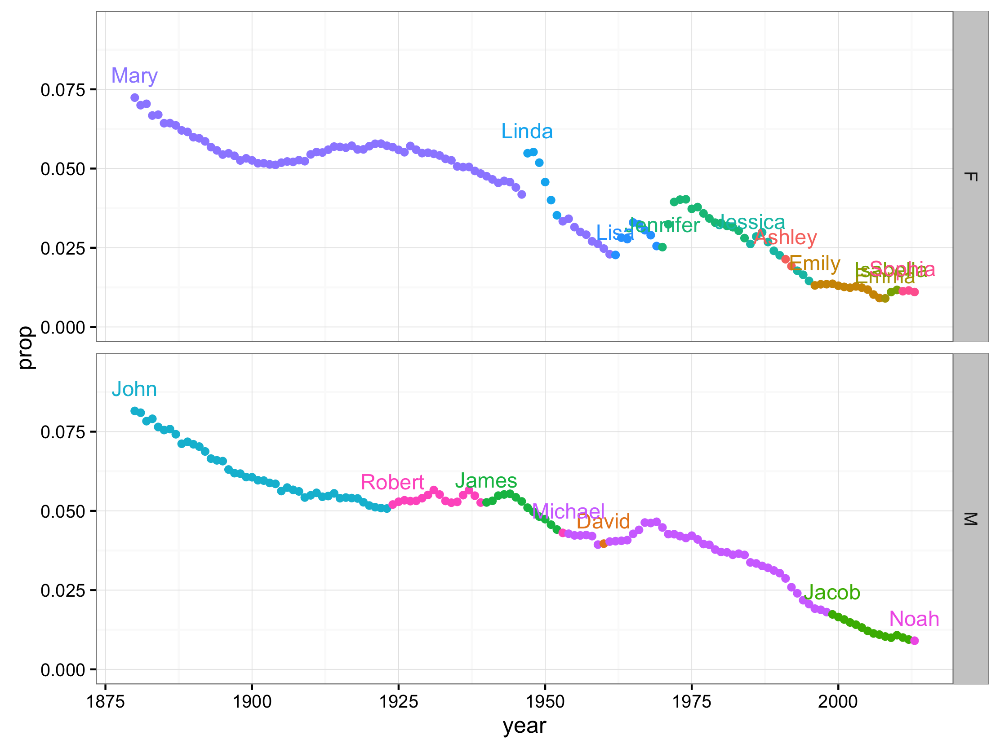
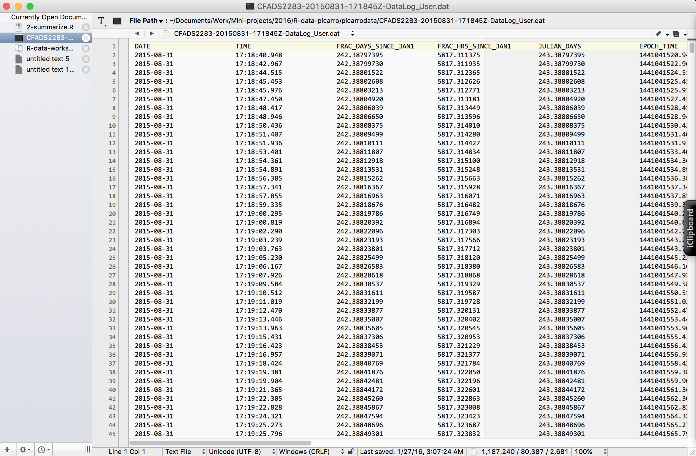

Reproducible data analysis using R
========================================================
author: Ben Bond-Lamberty
date: February 2016
font-family: 'Helvetica'

A workshop covering a bit of R basics; reproducibility; graphics and pipelines; and data summarizing and manipulation.

Purdue University


The next three hours of your life
========================================================

* Introduction: R basics and reproducible research (45 minutes; hands-on: installing the packages we'll need)
* Examining and cleaning data (45 minutes; hands-on: the `iris` dataset)
* Summarizing and manipulating data (45 minutes; hands-on: the `babynames` dataset)
* Bringing things together: working with Picarro data (45 minutes; hands-on: Picarro data)

Feedback: <a href="mailto:bondlamberty@pnnl">Email</a>  [Twitter](https://twitter.com/BenBondLamberty)


Is R the right tool for the job?
========================================================

>R has simple and obvious appeal. Through R, you can sift through complex data sets, manipulate data through sophisticated modeling functions, and create sleek graphics to represent the numbers, in just a few lines of code...R’s greatest asset is the vibrant ecosystem has developed around it: The R community is constantly adding new packages and features to its already rich function sets.
>
>-- [The 9 Best Languages For Crunching Data](http://www.fastcompany.com/3030716/the-9-best-languages-for-crunching-data)


Is R the right tool for the job?
========================================================

But it might not be. R has limitations and weaknesses:
- nontrivial learning curve; quirks; inconsistent syntax
- documentation patchy and terse
- package quality varies
- not designed for *large* datasets

There are other tools that might be better for your specific need!
- Python, C++, Hadoop, CDO/NCL, bash, ...
- Excel in _extremely_ limited circumstances


Reproducibility
========================================================
type: section


Reproducibility
========================================================

We are in the era of collaborative 'big data', but even if you work by yourself with 'little data' you have to have some skills to deal with those data.

**Most fundamentally, your results have to be reproducible.**

>Your most important collaborator is your future self. It’s important to make a workflow that you can use time and time again, and even pass on to others in such a way that you don’t have to be there to walk them through it. [Source](http://berkeleysciencereview.com/reproducible-collaborative-data-science/)

Reproducibility generally means *scripts* or *programs* tied to *open source software*.


You can't reproduce
========================================================
...what doesn't exist.
- Gozilla ate my computer
+ backup
+ ideally *continuous*
- Godzilla ate my office
+ cloud

***


You can't reproduce
========================================================

...what you've lost. What if you need access to a file as it existed 1, 10, or 100, or 1000 days ago?
- Incremental backups (minimum)
- Version control (better). A *repository* holds files and tracks changes

***


Version control
========================================================

**Git** (and website **GitHub**) are the most popular version control tools for use with R, and many other languages:
- version control
- sharing code with collaborators
- issue tracking
- social coding

***




Reproducible research example
========================================================

A typical project/paper directory for me:
```
1-download.R
2-process_data.R
3-analyze_data.R
4-make_graphs.R
logs/
output/
rawdata/
```

This directory contains *scripts* that are backed up both *locally* and *remotely*. It is under *version control*, so it's easy to track changes over time.


Reproducible research example
========================================================




Hands-on: setting up R and RStudio
========================================================
type: prompt
incremental: false

If you're doing the exercises and problems, you'll need these
packages:
- `dplyr` - fast, flexible tool for working with data frames
- `ggplot2` - popular package for visualizing data

We'll also use this data package:
- `babynames` - names provided to the SSA 1880-2013

Finally, we'll download a [repository](https://github.com/bpbond/R-data-picarro) (collection of code and data) for this workshop.

Let's do that, and get oriented in [RStudio](https://www.rstudio.com/products/RStudio/), now.


R basics
========================================================
type: section


Things you should know: basics
========================================================

This workshop assumes you understand a few basics of R:

- What R is
- How to start and quit it
- How to get help


```r
# This is a comment
# Get help for the `summary` function
?summary

# Get help for an entire package
help(package = 'ggplot2')
```


Things you should know: basics
========================================================

- The idea of *objects*, *functions*, *assignment*, and *comments*


```r
x <- 10 + 2 # `x` is an object
log(x) # `log` is a function
```

```
[1] 2.484907
```

- The idea of *data types*

```r
x <- 3.14     # numeric
y <- "hello"  # character
z <- TRUE     # logical
# We're going to avoid this next one
f <- factor(c("apple", "pear", "banana")) 
```


Things you should know: vectors
========================================================

- The *vector* data type


```r
myvector <- 1:5
myvector <- c(1, 2, 3, 4, 5)
myvector <- seq(1, 5)
myvector
```

```
[1] 1 2 3 4 5
```

```r
myvector[2:3]
```

```
[1] 2 3
```

***


```r
myvector * 2
```

```
[1]  2  4  6  8 10
```


```r
sum(myvector)
```

```
[1] 15
```


Things you should know: data frames
========================================================

- The idea of a *data frame* (tightly coupled vectors)


```r
head(cars)  # one of R's built-in datasets
```

```
  speed dist
1     4    2
2     4   10
3     7    4
4     7   22
5     8   16
6     9   10
```

Data frames are the most frequently used data type in R.


Things you should know: control flow
========================================================

- Basic  *control flow* statements


```r
if(sum(1:4) == 10) {
  print("right!")
} else {
  print("wrong!")
}
```

```
[1] "right!"
```


```r
for(i in 1:4) { cat(i) }
```

```
1234
```


Things you should know: scripts
========================================================

The difference between a *script* (stored program) and *command line* (immediate response).

In general, you want to use scripts, which provide *reproducibility*.


```r
source("myscript.R")
```

***


Things you should know: packages
========================================================

- *Packages* are pieces of software that can be loaded into R. There are thousands, for all kinds of tasks and needs.


```r
# The single most popular R  
# package is `ggplot2`
library(ggplot2)

# qplot = quick plot
qplot(speed, 
      dist, 
      data = cars)
```

***


Hands-on: examining the `iris` dataset
========================================================
type: prompt
incremental: false

Hands-on work in RStudio.
* Built-in datasets
* Using `summary`, `names`, `head`, `tail`
* Looking at particular rows and columns
* Subsetting the data
* Basic plots of the data


Computing on columns
========================================================

This can be simple...


```r
d <- data.frame(x = 1:3)
d$y <- d$x * 2
d$z <- cumsum(d$y) # cumulative sum
d$four <- ifelse(d$y == 4, "four", "not 4") 
d
```

```
  x y  z  four
1 1 2  2 not 4
2 2 4  6  four
3 3 6 12 not 4
```


Computing on columns
========================================================

...or more complex. For example, for [Picarro](http://www.picarro.com/products_solutions/trace_gas_analyzers/co_co2_ch4_h2o) data comes with multiplexer valve numbers (i.e., in an experiment, the multiplexer automatically switches between valves). Whenever the valve number changes, we want to assign a new sample number.


```r
# Toy data set
# Analyzer is switching between valves 1, 2, and 3
vn <- c(1, 1, 2, 3, 3, 3, 1, 2, 2, 3)
```

There are 6 samples here, and we want to produce `1, 1, 2, 3, 3, 3, 4, 5, 5, 6`.


Exercise: Computing on columns
========================================================


```r
# Works, but slow
samplenums <- rep(NA, length(vn))
samplenums[1] <- 1
s <- 1

# Loop and compare valve numbes one by one
for(i in 2:length(vn)) {
  if(vn[i] != vn[i-1])
    s <- s + 1
  samplenums[i] <- s
}
samplenums
```

```
 [1] 1 1 2 3 3 3 4 5 5 6
```


Exercise: Computing on columns
========================================================


```r
# Vectorised: fast and elegant
newvalve <- vn[-length(vn)] != vn[-1]
newvalve <- c(TRUE, newvalve)
newvalve
```

```
 [1]  TRUE FALSE  TRUE  TRUE FALSE FALSE  TRUE  TRUE FALSE  TRUE
```

```r
cumsum(newvalve)
```

```
 [1] 1 1 2 3 3 3 4 5 5 6
```


Exercise: Computing on columns - time
========================================================


This has big consequences!

For a data frame with 1,100,000 rows:

**The larger lesson to take away here** is that in R, `for` loops are rarely the fastest way to do something (although they may be the clearest).

When possible, take advantage of R's *vectorised operations*.


***


Understanding and dealing with NA
========================================================

One of R's strengths is that missing values are a first-class data type: `NA`.


```r
x <- c(1, 2, 3, NA)
# Which are NA?
is.na(x)
```

```
[1] FALSE FALSE FALSE  TRUE
```

```r
any(is.na(x))
```

```
[1] TRUE
```

***


```r
which(is.na(x))
```

```
[1] 4
```

```r
x[!is.na(x)]
```

```
[1] 1 2 3
```


Understanding and dealing with NA
========================================================

Like `NaN` and `Inf`, generally `NA` 'poisons' operations, so NA values must be explicitly ignored and/or removed.


```r
x <- c(1, 2, 3, NA)
sum(x) # NA
```

```
[1] NA
```

```r
sum(x, na.rm = TRUE)
```

```
[1] 6
```


Dealing with dates
========================================================

R has a `Date` class representing calendar dates, and an `as.Date` function for converting to Dates. The `lubridate` package is often useful (and easier) for these cases:


```r
library(lubridate)
x <- c("09-01-01", "09-01-02") # character!
ymd(x)   # there's also dmy, ymd_hms, etc.
```

```
[1] "2009-01-01 UTC" "2009-01-02 UTC"
```

Once data are in `Date` format, the time interval between them can be computed simply by subtraction. See `?difftime`


Merging datasets
========================================================

Often, as we clean and reshape data, we want to merge different datasets together. The built-in `merge` command does this well.

Let's say we have a data frame containing information on how pretty each of the `iris` species is:


```
     Species pretty
1     setosa   ugly
2 versicolor     ok
3  virginica lovely
```


Merging datasets
========================================================

`merge` looks for names in common between two data frames, and uses these to merge.


```r
merge(iris, howpretty)
```


```
  Species Sepal.Length pretty
1  setosa          5.1   ugly
2  setosa          4.9   ugly
3  setosa          4.7   ugly
4  setosa          4.6   ugly
5  setosa          5.0   ugly
6  setosa          5.4   ugly
```

(Viewing only a few columns and rows.) The `dplyr` package has more varied, faster database-style join operations.


Summarizing and manipulating data
========================================================
type: section


History lesson
========================================================




Summarizing and manipulating data
========================================================

Thinking back to the typical data pipeline, we often want to summarize data by groups as an intermediate or final step. For example, for each subgroup we might want to:

* Compute mean, max, min, etc. (`n`->1)
* Compute rolling mean and other window functions (`n`->`n`)
* Fit models and extract their parameters, goodness of fit, etc.

Specific examples:

* `cars`: for each speed, what's the farthest distance traveled?
* `iris`: how many samples were taken from each species?
* `babynames`: what's the most common name over time?


Split-apply-combine
========================================================

These are generally known as *split-apply-combine* problems.


From https://github.com/ramnathv/rblocks/issues/8


aggregate
========================================================

Base R has an `aggregate` function. It's not particularly fast or flexible, and confusingly it has different forms (syntax).

It can however be useful for simple operations:


```r
# What's the farthest distance at each speed?
aggregate(dist ~ speed, 
          data = cars, FUN = max)
```

```
   speed dist
1      4   10
2      7   22
3      8   16
4      9   10
5     10   34
6     11   28
7     12   28
8     13   46
9     14   80
10    15   54
11    16   40
12    17   50
13    18   84
14    19   68
15    20   64
16    22   66
17    23   54
18    24  120
19    25   85
```


dplyr
========================================================

The newer `dplyr` package specializes in data frames, recognizing that most people use them most of the time.

`dplyr` also allows you to work with remote, out-of-memory databases, using exactly the same tools, because it abstracts away *how* your data is stored.

`dplyr` is **extremely fast**.


Operation pipelines in R
========================================================

`dplyr` *imports*, and its examples make heavy use of, the [magrittr](https://github.com/smbache/magrittr) package, which introduces a **pipeline** operator `%>%` to R.

Not everyone is a fan of piping, and there are situations where it's not appropriate; but we'll stick to `dplyr` convention and use it frequently.


Operation pipelines in R
========================================================

Standard R notation:


```r
x <- read_my_data(f)
y <- merge_data(clean_data(x), otherdata)
z <- summarize_data(y)
```

Notation using a `magrittr` pipeline:


```r
read_my_data(f) %>%
  clean_data %>%
  merge_data(otherdata) %>%
  summarize_data ->
  z
```


Verbs
========================================================

`dplyr` provides functions for each basic *verb* of data manipulation. These tend to have analogues in base R, but use a consistent, compact syntax, and are very high performance.

* `filter()` - subset rows; like `base::subset()`
* `arrange()` - reorder rows; like `order()`
* `select()` - select columns
* `mutate()` - add new columns
* `summarise()` - like `aggregate`


Grouping
========================================================

`dplyr` verbs become particularly powerful when used in conjunction with *groups* we define in the dataset. The `group_by` function converts an existing data frame into a grouped `tbl`.


```r
library(dplyr)
cars %>%
  group_by(speed)
```

```
Source: local data frame [50 x 2]
Groups: speed [19]

   speed  dist
   (dbl) (dbl)
1      4     2
2      4    10
3      7     4
4      7    22
5      8    16
6      9    10
7     10    18
8     10    26
9     10    34
10    11    17
..   ...   ...
```


Summarizing cars
========================================================

We previously did this using `aggregate`. Now, `dplyr`:


```r
cars %>% 
  group_by(speed) %>% 
  summarise(max(dist))
```

```
Source: local data frame [19 x 2]

   speed max(dist)
   (dbl)     (dbl)
1      4        10
2      7        22
3      8        16
4      9        10
5     10        34
6     11        28
7     12        28
8     13        46
9     14        80
10    15        54
11    16        40
12    17        50
13    18        84
14    19        68
15    20        64
16    22        66
17    23        54
18    24       120
19    25        85
```


Summarizing iris
========================================================


```r
iris %>% 
  group_by(Species) %>% 
  summarise(msl = mean(Sepal.Length))
```

```
Source: local data frame [3 x 2]

     Species   msl
      (fctr) (dbl)
1     setosa 5.006
2 versicolor 5.936
3  virginica 6.588
```


Summarizing iris
========================================================

We can apply (multiple) functions across (multiple) columns.


```r
iris %>% 
  group_by(Species) %>% 
  summarise_each(funs(mean, median, sd), 
                 Sepal.Length)
```

```
Source: local data frame [3 x 4]

     Species  mean median        sd
      (fctr) (dbl)  (dbl)     (dbl)
1     setosa 5.006    5.0 0.3524897
2 versicolor 5.936    5.9 0.5161711
3  virginica 6.588    6.5 0.6358796
```


Introduction `babynames`
========================================================


```r
library(babynames)
babynames
```

```
Source: local data frame [1,792,091 x 5]

    year   sex      name     n       prop
   (dbl) (chr)     (chr) (int)      (dbl)
1   1880     F      Mary  7065 0.07238359
2   1880     F      Anna  2604 0.02667896
3   1880     F      Emma  2003 0.02052149
4   1880     F Elizabeth  1939 0.01986579
5   1880     F    Minnie  1746 0.01788843
6   1880     F  Margaret  1578 0.01616720
7   1880     F       Ida  1472 0.01508119
8   1880     F     Alice  1414 0.01448696
9   1880     F    Bertha  1320 0.01352390
10  1880     F     Sarah  1288 0.01319605
..   ...   ...       ...   ...        ...
```


Summarizing babynames
========================================================

What does this calculate?


```r
babynames %>%
  group_by(year, sex) %>% 
  summarise(prop = max(prop), 
            name = name[which.max(prop)])
```

```
Source: local data frame [268 x 4]
Groups: year [?]

    year   sex       prop  name
   (dbl) (chr)      (dbl) (chr)
1   1880     F 0.07238359  Mary
2   1880     M 0.08154561  John
3   1881     F 0.06998999  Mary
4   1881     M 0.08098075  John
5   1882     F 0.07042473  Mary
6   1882     M 0.07831552  John
7   1883     F 0.06673052  Mary
8   1883     M 0.07907113  John
9   1884     F 0.06698985  Mary
10  1884     M 0.07648564  John
..   ...   ...        ...   ...
```


Summarizing babynames
========================================================



https://en.wikipedia.org/wiki/Linda_(1946_song)


Why use dplyr?
========================================================

* Clean, concise, and consistent syntax.

* In general `dplyr` is ~10x faster than the older `plyr` package. (And `plyr` was ~10x faster than base R.)

* Same code can work with data frames or remote databases.


Hands-on: manipulating the `babynames` dataset
========================================================
type: prompt
incremental: false

Load the dataset using `library(babynames)`.

Read its help page. Look at its structure (rows, columns, summary).

Use `dplyr` to calculate the total number of names in the SSA database for each year. 

Calculate the 5th most popular name for girls in each year. Hint: `nth()`.


Processing Picarro data
========================================================
type: section


Picarro data
========================================================

The Picarro outputs text files with names like 

>CFADS2283-20150831-171845Z-DataLog_User.dat 

>(1.2 MB)

They're bulky and I will often store them gzip'd or zip'd (R will transparently decompress on reading).

>CFADS2283-20150831-171845Z-DataLog_User.dat.gz

>0.1 MB


Picarro data
========================================================

These files are straightfoward text files.




Picarro data
========================================================

Data in the Picarro output stream include:

* **`DATE`: yyyy-mm-dd format**
* **`TIME`: hh:mm:ss.sss**
* Time in other forms: `FRAC_DAYS_SINCE_JAN1`, `FRAC_HRS_SINCE_JAN1`, `JULIAN_DAYS`, `EPOCH_TIME`
* `ALARM_STATUS` and `INST_STATUS`
* `species`
* **`MPVPosition` and `solenoid_valves`**
* **Gas data: `CH4`, `CH4_dry`, `CO2`, `CO2_dry`, `H2O`, `h2o_reported`**


Picarro data cautions
========================================================
type: alert
incremental: true

**Fractional `MPVPosition` valve numbers**

The analyzer records fractional valve numbers when switching between multiplexer valves. You'll want to discard these.

**Date and time stamps**

Know what time the analyzer is set to. If local time, does your experiment cross a daylight savings transition? Does it cross into a new year (which would screw up e.g. `FRAC_HRS_SINCE_JAN1`)?

I recommend setting it to UTC and LEAVE IT THERE. Then it's easy to convert the `DATE` and `TIME` fields into a true R date field and adjust to local time zone if necessary.


Getting data into R
========================================================

The most common way to bring data into R is via `read.table`:

```r
d <- read.table("mydata.csv", header = TRUE)
```

The `readr` package provides read_table, which is faster and easier to use.

```r
library(readr)
d <- read_table("mydata.csv")
```


Hands-on: Picarro data
========================================================
type: prompt

Let's open the `picarro.R` file, which I started but didn't finish.

At this point, we have the tools to complete the job. Can you help?


Things we didn't talk about
========================================================

- reading data into R (not much)
- working with non-text data
- reshaping data
- writing data
- graphing data


Last thoughts
========================================================

>The best thing about R is that it was written by statisticians. The worst thing about R is that it was written by statisticians.
>
>-- Bow Cowgill

All the source code for this presentation is available at https://github.com/bpbond/R-data-picarro


Resources
========================================================
type: section


Resources
========================================================

* [CRAN](http://cran.r-project.org) - The Comprehensive R Archive Network.
* [GitHub](https://github.com/JGCRI) - The JGCRI organization page on GitHub.
* [RStudio](http://www.rstudio.com) - the integrated development environment for R. Makes many things hugely easier.
* [Advanced R](http://adv-r.had.co.nz) - the companion website for “Advanced R”, a book in Chapman & Hall’s R Series. Detailed, in depth look at many of the issues covered here.


Resources
========================================================

R has many contributed *packages* across a wide variety of scientific fields. Almost anything you want to do will have packages to support it.

[CRAN](http://cran.r-project.org) also provides "Task Views". For example:

***

- Bayesian
- Clinical Trials
- Differential Equations
- Finance
- Genetics
- HPC
- Meta-analysis
- Optimization
- [**Reproducible Research**](http://cran.r-project.org/web/views/ReproducibleResearch.html)
- Spatial Statistics
- Time Series
