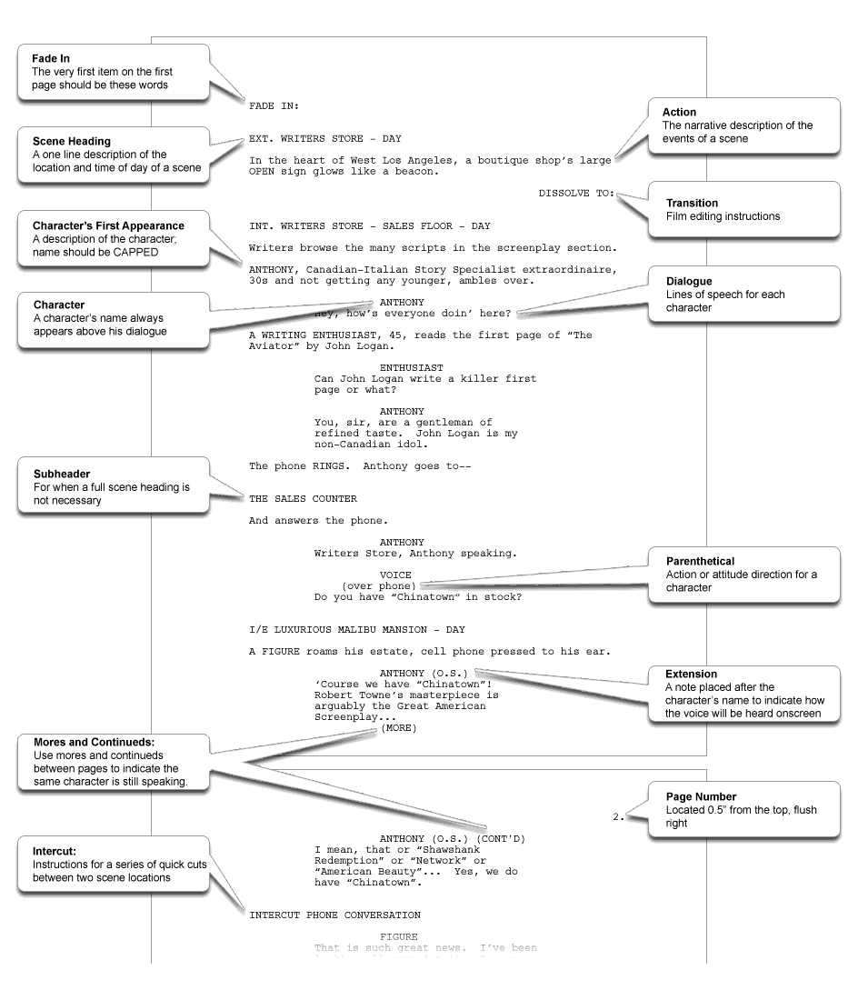

Data analysis and management using R
========================================================
author: Ben Bond-Lamberty
date: April 2017
font-family: 'Helvetica'

A _short_ workshop covering reproducibility and data management; data reshaping; and summarizing and manipulation.

Stanford University


The plan
========================================================

* Reproducible research and data management (30 minutes)
* Filtering and reshaping data (45 minutes; the `gapminder` dataset)
* Summarizing and manipulating data (45 minutes; the `babynames` dataset)

Feedback: <a href="mailto:bondlamberty@pnnl">bondlamberty@pnnl.gov</a> or  [@BenBondLamberty](https://twitter.com/BenBondLamberty).


Requirements
========================================================

This workshop assumes an intermediate knowledge of R.

If you want to do the hands-on exercises (encouraged!), make sure up-to-date versions of the following packages are installed:
* `dplyr`
* `tidyr`
* `gapminder`
* `babynames`


Reproducibility and data management
========================================================
type: section


Reproducibility
========================================================

We are in the era of collaborative 'big data', but even if you work by yourself with 'little data' you have to have some skills to deal with those data.

**Most fundamentally, your results have to be reproducible.**

>Your most important collaborator is your future self. It’s important to make a workflow that you can use time and time again, and even pass on to others in such a way that you don’t have to be there to walk them through it. [Source](http://berkeleysciencereview.com/reproducible-collaborative-data-science/)


Reproducibility
========================================================

Even if you don't buy it, **prepare yourself for the future**. Funders, journals, governments, colleagues are all pushing for more reproducibility and openness. It's a slow but steady ratchet.

NSF, DOE, Wellcome, Gates, etc. are increasingly requiring data management plans; data deposition; publication in open-access journals.

>Please ensure the data shown in all figures, and supporting all main results, is publicly available, describing this is in the text. Note that it is not acceptable for the authors to be the sole named individuals responsible for ensuring data access.


Reproducibility
========================================================

Reproducibility generally means *scripts* tied to *open source software* with effective *data management* and *archiving*.

Scripts provide an auditable, reproducible record of what you did.

***




You can't reproduce
========================================================
...what doesn't exist.

**Gozilla ate my computer!**
* *automated* backup
* ideally *continuous*

**Godzilla destroyed my office!!!!!!**
* offsite (cloud)

***


You can't reproduce
========================================================

...what you've lost. What if you need access to a file as it existed 1, 10, or 100, or 1000 days ago?
- Incremental backups (minimum)
- Version control. A *repository* holds files and tracks changes: what, by whom, why

***


Version control
========================================================

**Git** (and website **GitHub**) are the most popular version control tools for use with R, and many other languages:
- version control
- sharing code with collaborators in a *repository*
- issue tracking
- public or private

***


Version control
========================================================

As a [recent paper](http://dx.doi.org/10.1088/1748-9326/11/8/084004) noted, version control is **not easy enough yet**. It needs to get better.

***


Data management during analysis
========================================================

Version control and scripts address two of the biggest problems with managing data: tracking *changes over time*, and understanding/reproducing *analytical steps*.

Ideally, _every_ step in your analysis is programmatic--done by a script--so it can be 'read': understood and reproduced later.

See e.g. Sandve et al. (2013), [Ten Simple Rules for Reproducible Computational Research](https://doi.org/10.1371/journal.pcbi.1003285).


Full reproducibility is hard!
========================================================


Reproducibility is a process
========================================================

Upgrade and improve your workflow and skills over time.

>Organizing analyses so that they are reproducible is not easy. It requires diligence and a considerable investment of time: to learn new computational tools, and to organize and document analyses as you go.

>But partially reproducible is better than not at all reproducible. Just try to make your next paper or project better organized than the last.

A great and practical guide: http://kbroman.org/steps2rr/


Reproducible research example
========================================================

A typical project/paper directory for me:
```
1-download.R
2-process_data.R
3-analyze_data.R
4-make_graphs.R
5-manuscript.R   (perhaps)
logs/
output/
rawdata/
```

This directory contains *scripts* that are backed up both *locally* and *remotely*. It is under *version control*, so it's easy to track changes over time.


Reproducible research example
========================================================

```
Mon Mar  6 09:12:49 2017  Opening outputs//2-prepdata/2-prepdata.R.log.txt 
Mon Mar  6 09:12:49 2017  Welcome to 2-prepdata.R 
...
Mon Mar  6 12:24:21 2017  All done 2-prepdata.R

R version 3.3.3 (2017-03-06)
Platform: x86_64-apple-darwin13.4.0 (64-bit)
Running under: OS X El Capitan 10.11.6

locale:
[1] en_US.UTF-8/en_US.UTF-8/en_US.UTF-8/C/en_US.UTF-8/en_US.UTF-8

attached base packages:
[1] stats     graphics  grDevices utils     datasets  methods   base     

other attached packages:
[1] babynames_0.3.0

loaded via a namespace (and not attached):
[1] assertthat_0.1 tools_3.3.3    tibble_1.2     Rcpp_0.12.9   
```


Data management after publication
========================================================

[Vines et al. (2014)](http://dx.doi.org/10.1016/j.cub.2013.11.014) published a shocking finding, based on a survey of 516 biology articles from 2 to 22 years old:

>The odds of a data set being available post-publication fell by 17% each year, and the chances that the contact author’s email address still worked declined by 7% per year.

Data loss hits ecosystem, soil, and global change ecology particularly hard: climate changes make ecological data effectively irreproducible.


Data management after publication
========================================================

In my opinion, many repositories and archives have made it _way too hard_ to deposit data.

>Please fill out this 100-item questionnaire, entering carbon flux numbers in some units you've never used before. Also, you need to put your data into our required format, which is going to be a complete PITA, and write up a 1000-word metadata file in Aramaic.

I exaggerate only slightly.


Data management after publication
========================================================

Don't let the perfect be the enemy of the good.

Be aware of 'unstructured' data repositories like [GitHub](https://github.com) (intended primarily for code), [figshare](https://figshare.com) (super easy, gives instant DOIs), etc.

Far better the data be available permanently, however imperfectly they're formatted or described (though those things are good), than lost forever.

Again, a practical guide: http://kbroman.org/steps2rr/


Data management after publication
========================================================

This has the promise to

* Fight the data loss problem described by Vines et al.
* Fight the "file drawer problem"
* Increase trust in science
* **SPEED UP AND ENABLE NEW SCIENCE**

See for example BAAD, SRDB, TRY, FRED, FLUXNET!

These vary in their degree of structure, centralization, and openness, but are all hugely better than nothing.


Hands-on: setting up
========================================================
type: prompt
incremental: false

If you're doing the exercises and problems, you'll need these
packages:
- `dplyr` - fast, flexible tool for working with data frames
- `tidyr` - reshaping and cleaning data
- `ggplot2` - popular package for visualizing data

We'll also use these data package:
- `babynames` - names provided to the SSA 1880-2013
- `gapminder` - life expectancy, GDP per capita, and population for 142 countries


Reshaping datasets
========================================================

In honor of the late [Hans Rosling](https://en.wikipedia.org/wiki/Hans_Rosling), we'll use the `gapminder` dataset today.


```r
library(dplyr)
library(gapminder)
gapminder
```

```
# A tibble: 1,704 × 6
       country continent  year lifeExp      pop gdpPercap
        <fctr>    <fctr> <int>   <dbl>    <int>     <dbl>
1  Afghanistan      Asia  1952  28.801  8425333  779.4453
2  Afghanistan      Asia  1957  30.332  9240934  820.8530
3  Afghanistan      Asia  1962  31.997 10267083  853.1007
4  Afghanistan      Asia  1967  34.020 11537966  836.1971
5  Afghanistan      Asia  1972  36.088 13079460  739.9811
6  Afghanistan      Asia  1977  38.438 14880372  786.1134
7  Afghanistan      Asia  1982  39.854 12881816  978.0114
8  Afghanistan      Asia  1987  40.822 13867957  852.3959
9  Afghanistan      Asia  1992  41.674 16317921  649.3414
10 Afghanistan      Asia  1997  41.763 22227415  635.3414
# ... with 1,694 more rows
```


Pipelines
========================================================

The `magrittr` package (used by both `dplyr` and `tidyr`) provides the `%>%` operator, which allows us to pipe an object forward into a function or call expression.

Note that `x %>% f` is _usually_ equivalent to `f(x)`.


```r
print(gapminder)
gapminder %>% print
gagminder %>% head
gapminder %>% head(n=20)
gapminder %>% 
  print %>% 
  summary    # what is non-piped equivalent?
summary(print(gapminder))
```


Pipelines
========================================================

By default, the left hand expression is put in as the first argument of the right hand expression (rhs). But you can put it into any other position too:


```r
library(ggplot2)
gapminder %>% qplot(gdpPercap, lifeExp, data=., log="xy")
gapminder %>% qplot(gdpPercap, lifeExp, data=., log="xy", color=continent, size=pop)
gapminder %>% qplot(gdpPercap, lifeExp, data=., log="xy", color=year, size=pop)

help("%>%")
```


Tibbles
========================================================

Notice when we print `gapminder` only a bit of the data frame prints, whereas if we type `cars` (a built-in dataset) everything scrolls off the screen. Examine:


```r
class(cars)
```

```
[1] "data.frame"
```

```r
class(gapminder)
```

```
[1] "tbl_df"     "tbl"        "data.frame"
```


Tibbles
========================================================

Tibbles are a re-imagining of R's venerable `data.frame` for more convenience and speed:
* Only print first 10 rows and columns that fit on screen
* Subsetting always returns data frame
* Never changes the type of data (no factors)
* Faster in many operations
* Usually (but not always) drop-in substitute

For more information, see `?tibble::tibble`.


dplyr
========================================================

The `dplyr` package uses _verbs_ (functions) to operate on _tibbles_ (data frames).


filter
========================================================

Very commonly used.


```r
gapminder %>% filter(country == "Egypt")
gapminder %>% filter(country == "Egypt", year > 2000)
```

IMPORTANT NOTE AT THIS POINT. We have `dplyr::filter` but there's also `stats::filter` in base R; similar confusing can exist for other `dplyr` verbs too.

**Either load `dplyr` last or specify which function you want to use.**


select
========================================================

Also extremely useful. Note different notations for selecting columns:


```r
select(gapminder, pop, year)
gapminder %>% select(pop, year)
gapminder %>% select(-lifeExp, -gdpPercap)
gapminder %>% select(-1)
```

There are lots of other cool ways to select columns--see `?select`.


Reshaping data
========================================================
type: prompt
incremental: true

Let's focus on a single country's data for a bit. Write a pipeline that picks out Egypt data only, removes the continent and country columns, and assigns the result to a variable `Egypt`.


```r
gapminder %>% 
  filter(country == "Egypt") %>% 
  select(-continent, -country) -> 
  Egypt
```


Reshaping data
========================================================

Put this into long format--where every row is a different observation. For this we use `tidyr::gather`, which asks: what's the data source? Name of variable column (i.e. that will get old names of columns)? Name of data column? And what columns to operate on?


```r
library(tidyr)
Egypt %>% gather(variable, value, lifeExp, pop, gdpPercap)
```

```
# A tibble: 36 × 3
    year variable  value
   <int>    <chr>  <dbl>
1   1952  lifeExp 41.893
2   1957  lifeExp 44.444
3   1962  lifeExp 46.992
4   1967  lifeExp 49.293
5   1972  lifeExp 51.137
6   1977  lifeExp 53.319
7   1982  lifeExp 56.006
8   1987  lifeExp 59.797
9   1992  lifeExp 63.674
10  1997  lifeExp 67.217
# ... with 26 more rows
```


Reshaping data
========================================================


```r
library(ggplot2)
Egypt %>% 
  gather(variable, value, -year) %>% 
  qplot(year, value, data=., geom="line") + 
   facet_wrap(~variable, scales="free")
```


Reshaping data
========================================================

Experiment. Why do these do what they do?


```r
Egypt %>% gather(variable, value, lifeExp)
Egypt %>% gather(variable, value, -lifeExp)
```

Why?


Reshaping data
========================================================

We can also spread our data out into a table form, like what you'd see in a spreadsheet, using `spread`:


```r
Egypt %>% 
  gather(variable, value, -year) %>% 
  spread(year, value)
```

`spread` is easy. It asks, 
* What goes across the new column names? 
* What's the data column to use?


Uniting, separating, mutating, and renaming
========================================================

These functions can be very useful.


```r
gapminder %>% unite(coco, country, continent)
gapminder %>% 
  unite(coco, country, continent) %>% 
  separate(coco, into = c("country", "continent"), sep="_", extra="merge")
gapminder %>% mutate(logpop = log(pop))
gapminder %>% rename(population = pop)
```


Summarizing data
========================================================
type: section


Summarizing and manipulating data
========================================================

Thinking back to the typical data pipeline, we often want to summarize data by groups as an intermediate or final step. For example, for each subgroup we might want to:

* Compute mean, max, min, etc. (`n`->1)
* Compute rolling mean and other window functions (`n`->`n`)
* Fit models and extract their parameters, goodness of fit, etc.

Specific examples:

* `gapminder`: what's the year of maximum GDP for each country?
* `babynames`: what's the most common name over time?


Split-apply-combine
========================================================

These are generally known as *split-apply-combine* problems.


From https://github.com/ramnathv/rblocks/issues/8


dplyr
========================================================

The newer `dplyr` package specializes in data frames, recognizing that most people use them most of the time.

`dplyr` also allows you to work with remote, out-of-memory databases, using exactly the same tools, because it abstracts away *how* your data is stored.

`dplyr` is **extremely fast** for most, though not all, kinds of data that can be stored in data frames.


Verbs
========================================================

`dplyr` provides functions for each basic *verb* of data manipulation. These tend to have analogues in base R, but use a consistent, compact syntax, and are very high performance.

* `filter()` - subset rows; like `base::subset()`
* `arrange()` - reorder rows; like `order()`
* `select()` - select columns
* `mutate()` - add new columns
* `summarise()` - like `aggregate`


Why use dplyr?
========================================================

* Clean, concise, and consistent syntax.

* In general `dplyr` is ~10x faster than the older `plyr` package. (And `plyr` was ~10x faster than base R.)

* Same code can work with data frames or remote databases.


Grouping
========================================================

`dplyr` verbs become particularly powerful when used in conjunction with *groups* we define in the dataset. This doesn't change the data but instead groups it, ready for the next operation we perform.


```r
library(dplyr)
gapminder %>% 
  group_by(country)
```

```
Source: local data frame [1,704 x 6]
Groups: country [142]

       country continent  year lifeExp      pop gdpPercap
        <fctr>    <fctr> <int>   <dbl>    <int>     <dbl>
1  Afghanistan      Asia  1952  28.801  8425333  779.4453
2  Afghanistan      Asia  1957  30.332  9240934  820.8530
3  Afghanistan      Asia  1962  31.997 10267083  853.1007
4  Afghanistan      Asia  1967  34.020 11537966  836.1971
5  Afghanistan      Asia  1972  36.088 13079460  739.9811
6  Afghanistan      Asia  1977  38.438 14880372  786.1134
7  Afghanistan      Asia  1982  39.854 12881816  978.0114
8  Afghanistan      Asia  1987  40.822 13867957  852.3959
9  Afghanistan      Asia  1992  41.674 16317921  649.3414
10 Afghanistan      Asia  1997  41.763 22227415  635.3414
# ... with 1,694 more rows
```


Summarising
========================================================


```r
gapminder %>% 
  group_by(country) %>% 
  summarise(max(pop))
```

```
# A tibble: 142 × 2
       country `max(pop)`
        <fctr>      <int>
1  Afghanistan   31889923
2      Albania    3600523
3      Algeria   33333216
4       Angola   12420476
5    Argentina   40301927
6    Australia   20434176
7      Austria    8199783
8      Bahrain     708573
9   Bangladesh  150448339
10     Belgium   10392226
# ... with 132 more rows
```


Summarising
========================================================


```r
gapminder %>% 
  group_by(country) %>% 
  summarise(maxpop = max(pop))
```

```
# A tibble: 142 × 2
       country    maxpop
        <fctr>     <int>
1  Afghanistan  31889923
2      Albania   3600523
3      Algeria  33333216
4       Angola  12420476
5    Argentina  40301927
6    Australia  20434176
7      Austria   8199783
8      Bahrain    708573
9   Bangladesh 150448339
10     Belgium  10392226
# ... with 132 more rows
```


Summarising
========================================================

We can apply a function to multiple columns, or multiple functions to a column (or both):


```r
gapminder %>% 
  select(-continent, -year) %>% 
  group_by(country) %>% 
  summarise_all(max)
gapminder %>% 
  select(country, pop) %>% 
  group_by(country) %>% 
  summarise_all(max)
gapminder %>% 
  group_by(country) %>% 
  summarise_if(is.numeric, max)
```


Summarising
========================================================

We can apply a function to multiple columns, or multiple functions to a column (or both):


```r
gapminder %>% 
  select(country, pop) %>% 
  group_by(country) %>% 
  summarise_all(funs(min, max, mean))
gapminder %>% 
  select(-year) %>% 
  group_by(country) %>% 
  summarise_if(is.numeric, funs(min, max, mean))
```


Summarising
========================================================

We can build up a long pipeline to, e.g., summarise min, mean, max for all numeric variables and end up with a table with min-mean-max as columns headers, and variable (gdpPercap, lifeExp, pop) rows.


```r
gapminder %>% 
  select(-year) %>% 
  group_by(country) %>% 
  summarise_if(is.numeric, funs(min, max, mean)) %>% 
  gather(variable, value, -country) %>% 
  separate(variable, into=c("variable", "stat")) %>% 
  spread(stat, value)
```


Introducing `babynames`
========================================================

Explore `babynames` a bit. How many rows, columns does it have? How many unique names?


```r
library(babynames)
babynames
```

```
# A tibble: 1,858,689 × 5
    year   sex      name     n       prop
   <dbl> <chr>     <chr> <int>      <dbl>
1   1880     F      Mary  7065 0.07238433
2   1880     F      Anna  2604 0.02667923
3   1880     F      Emma  2003 0.02052170
4   1880     F Elizabeth  1939 0.01986599
5   1880     F    Minnie  1746 0.01788861
6   1880     F  Margaret  1578 0.01616737
7   1880     F       Ida  1472 0.01508135
8   1880     F     Alice  1414 0.01448711
9   1880     F    Bertha  1320 0.01352404
10  1880     F     Sarah  1288 0.01319618
# ... with 1,858,679 more rows
```


Summarizing babynames
========================================================

What does this calculate?


```r
babynames %>%
  group_by(year, sex) %>% 
  summarise(prop = max(prop), 
            name = name[which.max(prop)])
```

```
Source: local data frame [272 x 4]
Groups: year [?]

    year   sex       prop  name
   <dbl> <chr>      <dbl> <chr>
1   1880     F 0.07238433  Mary
2   1880     M 0.08154630  John
3   1881     F 0.06999140  Mary
4   1881     M 0.08098299  John
5   1882     F 0.07042594  Mary
6   1882     M 0.07831617  John
7   1883     F 0.06673386  Mary
8   1883     M 0.07907324  John
9   1884     F 0.06699083  Mary
10  1884     M 0.07648751  John
# ... with 262 more rows
```


Summarizing babynames
========================================================


https://en.wikipedia.org/wiki/Linda_(1946_song)


Hands-on: the `babynames` dataset
========================================================
type: prompt
incremental: false

Load the dataset using `library(babynames)`.

Read its help page. Look at its structure (rows, columns, summary).

Use `dplyr` to calculate the total number of names in the SSA database for each year. Hint: `n()`.

Make a graph or table showing how popular YOUR name has been over time (either its proportion, or rank).


Summarizing babynames
========================================================


```r
babynames %>% 
  filter(name == "Benjamin") %>% 
  qplot(year, n, color = sex, data = .)

babynames %>% 
  group_by(year, sex) %>% 
  mutate(rank = row_number(desc(n))) %>% 
  filter(name == "Benjamin") %>% 
  qplot(year, rank, color = sex, data = .)
```


Summarizing babynames
========================================================


Things we didn't talk about
========================================================

- working with non-text data
- joins and merges


Last thoughts
========================================================

>The best thing about R is that it was written by statisticians. The worst thing about R is that it was written by statisticians.
>
>-- Bow Cowgill

All the source code for this presentation is available at https://github.com/bpbond/R-data-picarro


Resources
========================================================
type: section


Resources
========================================================

* [CRAN](http://cran.r-project.org) - The Comprehensive R Archive Network.
* [GitHub](https://github.com/JGCRI) - The JGCRI organization page on GitHub.
* [RStudio](http://www.rstudio.com) - the integrated development environment for R. Makes many things hugely easier.
* [Advanced R](http://adv-r.had.co.nz) - the companion website for “Advanced R”, a book in Chapman & Hall’s R Series. Detailed, in depth look at many of the issues covered here.


Resources
========================================================

R has many contributed *packages* across a wide variety of scientific fields. Almost anything you want to do will have packages to support it.

[CRAN](http://cran.r-project.org) also provides "Task Views". For example:

***

- Bayesian
- Clinical Trials
- Differential Equations
- Finance
- Genetics
- HPC
- Meta-analysis
- Optimization
- [**Reproducible Research**](http://cran.r-project.org/web/views/ReproducibleResearch.html)
- Spatial Statistics
- Time Series
