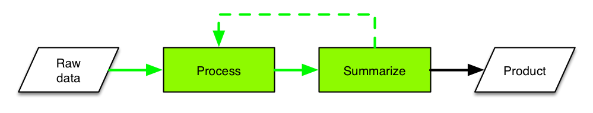
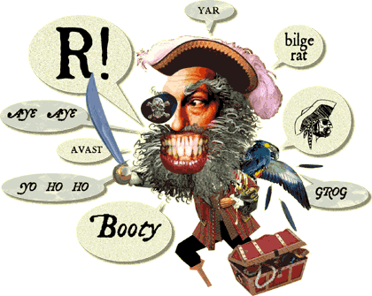

R and (Picarro) data
========================================================
author: Ben Bond-Lamberty
date: January 2016

A workshop covering R basics; reproducibility; data exploration, summarizing and manipulation; and issues specific to Picarro data.


The next three hours of your life
========================================================

* Introduction: R basics and reproducible research (45 minutes; hands-on: installing the packages we'll need)
* Examining and cleaning data (45 minutes; hands-on: the `iris` dataset)
* Summarizing and manipulating data (45 minutes; hands-on: the `babynames` dataset)
* Bringing things together: working with Picarro data (45 minutes; hands-on: Picarro data)

Three hours, 25% lecture and 75% working examples and problems.

Feedback: <a href="mailto:bondlamberty@pnnl">Email</a>  [Twitter](https://twitter.com/BenBondLamberty)


Focus of this workshop
========================================================



In a typical data pipeline:
- *Raw data* can come from many sources 
- *Processing* - cleaning, modifying, reshaping, QC
- *Summarizing* - merging with other data, groupwise summaries
- *Products* include output data, plots, statistical analyses


Is R the right tool for the job?
========================================================

>R has simple and obvious appeal. Through R, you can sift through complex data sets, manipulate data through sophisticated modeling functions, and create sleek graphics to represent the numbers, in just a few lines of code...R’s greatest asset is the vibrant ecosystem has developed around it: The R community is constantly adding new packages and features to its already rich function sets.
>
>-- [The 9 Best Languages For Crunching Data](http://www.fastcompany.com/3030716/the-9-best-languages-for-crunching-data)


Is R the right tool for the job?
========================================================

It's also very useful during _Talk Like A Pirate Day_.




Is R the right tool for the job?
========================================================

But it might not be. R has limitations and weaknesses:
- nontrivial learning curve; quirks; inconsistent syntax
- documentation patchy and terse
- package quality varies
- generally operates in-memory only

There are other tools that might be better for your specific need!
- Python, C++, Hadoop, CDO/NCL, bash, ...
- Excel in _extremely_ limited circumstances


Reproducibility
========================================================
type: section


Reproducibility
========================================================

We are in the era of 'big data', but even if you work with 'little data' you have to acquire some skills to deal with those data.

**Most fundamentally, your results have to be reproducible.**

**Reproducible by yourself, and others.**

**At any time in the future.**


You can't reproduce
========================================================
...what doesn't exist.
- Gozilla ate my computer
+ backup
+ ideally *continuous*
- Godzilla ate my office
+ cloud

***


You can't reproduce
========================================================

...what you've lost. What if you need access to a file as it existed 1, 10, or 100, or 1000 days ago?
- Incremental backups (minimum)
- Version control (better). A *repository* holds files and tracks changes

***


Version control
========================================================

**Git** and **GitHub** are the most popular (and free) version control tools for use with R, and many other languages:
- version control
- sharing code with collaborators
- issue tracking
- social coding

***


Reproducible research example
========================================================

A typical project/paper directory for me:
```
0-download.R
1-process_data.R
2-analyze_data.R
3-make_graphs.R
logs/
output/
rawdata/
```

This directory is generated by my [default script](https://github.com/bpbond/R_analysis_script). It is backed up both *locally* and *remotely*, and under *version control*.


Reproducible research example
========================================================

- Sequentially numbered R scripts (`0-download.R`, `1-process_data.R`, ...)
- Each script depends on the previous one
- Each has a discrete, logical function
- Each produces a *log file* including date/time, what R version was used, etc.
- This analytical chain starts with raw data
- ...and ends with figures and tables for ms
+ *or the ms itself!* This presentation, for example, was generated directly from an R file


Hands-on: setting up R and RStudio
========================================================
type: prompt
incremental: false

If you're doing the exercises and problems, you'll need these
packages:
- `dplyr` - fast, flexible tool for working with data frames
- `ggplot2` - popular package for visualizing data

We'll also use this data package:
- `babynames` - names provided to the SSA 1880-2013

Finally, we'll download a [repository](https://github.com/bpbond/R-data-picarro) (collection of code and data) for this workshop.

Let's do that, and get oriented in **RStudio**, now.


R basics
========================================================
type: section


Things you should know: basics
========================================================

This workshop assumes you understand the basics of using R:

- What R is
- How to start and quit it
- How to get help


```r
# Get help for a specific function
?summary

# Get help for an entire package
help(package = 'ggplot2')
```


Things you should know: basics
========================================================

- The idea of *objects*, *functions*, *assignment*, and *comments*


```r
x <- 10 + 2 # `x` is an object
sum(x) # `sum` is a function
```

```
[1] 12
```

- The idea of *data types*

```r
x <- 3.14     # numeric
y <- "hello"  # character
z <- TRUE     # logical
# We're going to avoid this next one
f <- factor(c("apple", "pear", "banana")) 
```


Things you should know: vectors
========================================================

- The *vector* data type


```r
myvector <- 1:5
myvector
```

```
[1] 1 2 3 4 5
```


```r
myvector * 2
```

```
[1]  2  4  6  8 10
```

***


```r
length(myvector)
```

```
[1] 5
```

```r
sum(myvector)
```

```
[1] 15
```


Things you should know: data frames
========================================================

- The idea of a *data frame* (tightly coupled vectors)

```r
head(cars)  # a built-in dataset
```

```
  speed dist
1     4    2
2     4   10
3     7    4
4     7   22
5     8   16
6     9   10
```
Data frames are the fundamental (in the sense of most frequently used) data type in R.


Things you should know: control flow
========================================================

- Most common control flow uses `if...then...else` and `for`


```r
if(sum(1:4) == 10) {
  print("right!")
} else {
  print("wrong!")
}
```

```
[1] "right!"
```


```r
for(i in 1:4) { cat(i) }
```

```
1234
```


Things you should know: scripts
========================================================

The difference between a *script* (stored program) and *command line* (immediate response).

In general, you want to use scripts, which provide *reproducibility*.


```r
source("myscript.R")
```

***


Things you should know: packages
========================================================

- *Packages* are pieces of software that can be optionally loaded and used. The package system is one of R's enormous strengths: there are thousands, written for all kinds of tasks and needs.


```r
library(ggplot2)
qplot(speed, dist, data = cars)
```

***

 


Hands-on: examining the `iris` dataset
========================================================
type: prompt
incremental: false

Hands-on work in RStudio.
* Built-in datasets
* Using `summary`, `names`, `head`, `tail`
* Looking at particular rows and columns
* Subsetting the data
* Basic plots of the data


Exercise: Examining data frames
========================================================
type: prompt


```r
library(babynames)
summary(babynames)
```

How many rows and columns are there in the `babynames` dataset?

What name is in row #12345?

How many unique baby names are there?

Make a new data frame with a random 1% of the original rows.

How many 19th century rows are there?


Exercise: Examining data frames
========================================================
type: prompt
incremental: true


```r
cat(dim(babynames), 
    as.character(babynames[12345, "name"]), 
    length(unique(babynames$name)))
```

```
1792091 5 Baxter 92600
```

```r
s <- babynames[sample(1:nrow(babynames), 
                      0.01 * nrow(babynames)),]

sum(babynames$year < 1900) # faster and more memory-efficient than nrow(subset(...))
```

```
[1] 52265
```


Cleaning data
========================================================

Usually, the first thing you'd like to do after importing data is *clean* it.

- change column types
- computing on columns
- splitting columns
- combining columns
- dealing with `NA` values


Computing on columns
========================================================

This can be simple...


```r
d <- data.frame(x=1:3)
d$y <- d$x * 2
d$z <- cumsum(d$y)
d$four <- ifelse(d$y == 4, "four", "not four") 
d
```

```
  x y  z     four
1 1 2  2 not four
2 2 4  6     four
3 3 6 12 not four
```

R provides a set of high performance functions for many of these tasks: `cumsum`, `colMeans`, `colSums`, `rowMeans`, `rowSums`, etc.


Exercise: Computing on columns
========================================================
type: prompt
incremental: true

One recent problem I had involved a data frame with multiplexer valve numbers; in the experiment, the multiplexer was automatically switching between valves.

Whenever the valve number changes, we want to assign a new sample number.


```r
# analyzer is switching between valves 1, 2, and 3
vnums <- c(1, 1, 2, 3, 3, 3, 1, 2, 2, 3)
# there are 6 samples here: (1, 1), (2), (3, 3, 3), (1), (2, 2), (3)

# There are ≥ two solutions
```


Exercise: Computing on columns
========================================================
type: prompt
incremental: true


```r
# Works, but slow
samplenums <- rep(1, length(vnums))
s <- 1
for(i in seq_along(vnums)[-1]) {
  if(vnums[i] != vnums[i-1])
    s <- s + 1
  samplenums[i] <- s
}
samplenums
```

```
 [1] 1 1 2 3 3 3 4 5 5 6
```


```r
# Vectorised: fast and elegant
newvalve <- c(TRUE,
              vnums[-length(vnums)] != vnums[-1])
cumsum(newvalve)
```

```
 [1] 1 1 2 3 3 3 4 5 5 6
```


Combining columns
========================================================

Combining columns is generally easy.

```r
d <- data.frame(x=1:3, y=4:6)
d$z <- with(d, paste("pasted", x, "and", y))  # note use of `with` here
d
```

```
  x y              z
1 1 4 pasted 1 and 4
2 2 5 pasted 2 and 5
3 3 6 pasted 3 and 6
```


Understanding and dealing with NA
========================================================

One of R's real strengths is that missing values are a first-class data type: `NA`.


```r
x <- c(1, 2, 3, NA)
is.na(x) # returns c(F, F, F, T)
```

```
[1] FALSE FALSE FALSE  TRUE
```

```r
any(is.na(x)) # returns TRUE
```

```
[1] TRUE
```

```r
which(is.na(x)) # returns ...?
```

```
[1] 4
```

Like `NaN` and `Inf`, generally `NA` 'poisons' operations, so it must be handled.


```r
sum(x) # NA
```

```
[1] NA
```

```r
sum(x, na.rm=TRUE) # 6
```

```
[1] 6
```

```r
na.omit(data.frame(x))  # remove rows with NA
```

```
  x
1 1
2 2
3 3
```


Dealing with dates
========================================================

R has a `Date` class representing calendar dates, and an `as.Date` function for converting to Dates. The `lubridate` package is often useful (and easier) for these cases:


```r
library(lubridate)
x <- c("09-01-01", "09-01-02")
ymd(x)   # there's also dmy and mdy!
```

```
[1] "2009-01-01 UTC" "2009-01-02 UTC"
```

Once data are in `Date` format, the time interval between them can be computed simply by subtraction. See also `?difftime`


Quiz: Cleaning Data
========================================================
type: prompt
incremental: true


```r
x <- -2:2
y <- 4/x 
y  # prints...?
```

```
[1]  -2  -4 Inf   4   2
```

```r
y <- y[is.finite(y)]
y  # prints...?
```

```
[1] -2 -4  4  2
```

***


```r
is.numeric(NA)
```

```
[1] FALSE
```

```r
is.numeric(Inf)
```

```
[1] TRUE
```

```r
is.infinite(Inf)
```

```
[1] TRUE
```


Merging datasets
========================================================

Often, as we clean and reshape data, we want to merge different datasets together. The built-in `merge` command does this well.

Let's say we have a data frame containing information on how pretty each of the `iris` species is:


```
     Species pretty
1     setosa   ugly
2 versicolor     ok
3  virginica lovely
```


Merging datasets
========================================================

`merge` looks for names in common between two data frames, and uses these to merge. Options allow us to control the merge behavior.


```r
merge(iris, howpretty)
```


```
  Species Sepal.Length pretty
1  setosa          5.1   ugly
2  setosa          4.9   ugly
3  setosa          4.7   ugly
4  setosa          4.6   ugly
5  setosa          5.0   ugly
6  setosa          5.4   ugly
```

The `dplyr` package has more varied, faster database-style join operations.


Summarizing and operating on data
========================================================
type: section


History lesson
========================================================


Summarizing and operating on data
========================================================

Thinking back to the typical data pipeline, we often want to summarize data by groups as an intermediate or final step. For example, for each subgroup we might want to:

* Compute mean, max, min, etc. (`n`->1)
* Compute rolling mean and other window functions (`n`->`n`)
* Fit models and extract their parameters, goodness of fit, etc.

Specific examples:

* `cars`: for each speed, what's the farthest distance traveled?
* `iris`: how many samples were taken from each species?
* `babynames`: what's the most common name over time?


Split-apply-combine
========================================================

These are generally known as *split-apply-combine* problems.


From https://ramnathv.github.io/pycon2014-r/explore/sac.html


The apply family
========================================================

Traditionally the *apply* family of functions was R's solution. Unfortunately they have inconsistent and confusing syntax, middling performance, and functional quirks.

Function      | Description
------------- | ------------
base::apply   |  Apply Functions Over Array Margins
base::by      |  Apply a Function to a Data Frame Split by Factors
base::eapply  |  Apply a Function Over Values in an Environment
**base::lapply**  |  **Apply a Function over a List or Vector**
base::mapply  |  Apply a Function to Multiple List or Vector Arguments
base::rapply  |  Recursively Apply a Function to a List
base::tapply  |  Apply a Function Over a Ragged Array

https://nsaunders.wordpress.com/2010/08/20/a-brief-introduction-to-apply-in-r/ provides a simple, readable summary of these.


aggregate
========================================================

R also has a built-in `aggregate` function. It's not particularly fast or flexible, and confusingly has a number of different forms. 

It can however be useful for simple operations:


```r
aggregate(dist ~ speed, data=cars, FUN=max)
```

```
   speed dist
1      4   10
2      7   22
3      8   16
4      9   10
5     10   34
6     11   28
7     12   28
8     13   46
9     14   80
10    15   54
11    16   40
12    17   50
13    18   84
14    19   68
15    20   64
16    22   66
17    23   54
18    24  120
19    25   85
```


dplyr
========================================================

The newer `dplyr` package makes a different tradeoff: it specializes in data frames, recognizing that most people use them most of the time, and is extremely fast.

`dplyr` also allows you to work with remote, out-of-memory databases, using exactly the same tools, because dplyr will translate your R code into the appropriate SQL.

In other words, `dplyr` abstracts away *how* your data is stored.


Operation pipelines in R
========================================================

`dplyr` *imports*, and its examples make heavy use of, the [magrittr](https://github.com/smbache/magrittr) package, which changes R syntax (remember, every operation is a function) to introduce a **pipe** operator `%>%`. This 
* structures sequences of data operations left-to-right (as opposed to inside-out)
* avoids nested function calls
* minimizes the need for local variables
* makes it easy to add steps anywhere in a sequence of operations

Not everyone is a fan of piping, and there are situations where it's not appropriate; but we'll stick to `dplyr` convention and use it frequently.


Operation pipelines in R
========================================================

Standard R notation:

```r
x <- read_my_data(f)
y <- process_data(clean_data(x), otherdata)
z <- summarize_data(y)
```

Notation using a `magrittr` pipe:

```r
z <- read_my_data(f) %>%
  clean_data() %>%
  process_data(otherdata) %>%
  summarize_data()
```


Operation pipelines in R
========================================================

Basic `magrittr` piping summary:

* `x %>% f` is equivalent to `f(x)`
* `x %>% f(y)` is equivalent to `f(x, y)`
* `x %>% f %>% g %>% h` is equivalent to `h(g(f(x)))`
* `x %>% f(y, .)` is equivalent to `f(y, x)`

Remember, `magrittr` is independent of `dplyr` - you can use pipes anywhere useful.


Verbs
========================================================

`dplyr` provides functions for each basic *verb* of data manipulation. These tend to have analogues in base R, but use a consistent, compact syntax, and are very high performance.

* `filter()` - subset rows; like `base::subset()`
* `arrange()` - reorder rows; is a wrapper for `order()`
* `select()` - select columns
* `mutate()` - add new columns; like `base::transform()
* `summarise()` - like `aggregate` or `plyr::ddply`


Grouping
========================================================

`dplyr` verbs become particularly powerful when used in conjunction with *groups* we define in the dataset. The `group_by` function converts an existing data frame into a grouped `tbl`.


```
Error in eval(expr, envir, enclos) : could not find function "group_by"
```
