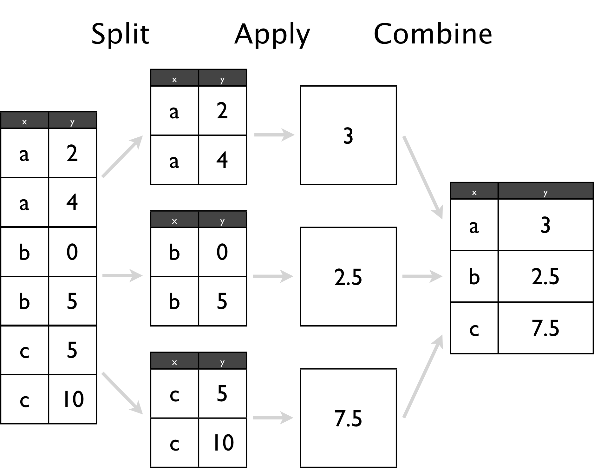

(More) reproducible data analysis using R
========================================================
author: Ben Bond-Lamberty
date: August 2016
font-family: 'Helvetica'

A workshop covering reproducibility and repository design; data cleaning and reshaping using `tidyr`; and using the `dplyr` package for computation.

JGCRI


The plan
========================================================

* Introduction: reproducible research and repository design (45 minutes; hands-on: installing the packages we'll need)
* Examining and cleaning data (45 minutes; hands-on: the `iris` and `Pew` datasets, CMIP5 example)
* Summarizing and manipulating data (90 minutes; hands-on: the `babynames` dataset)

**This workshop assumes you understand the basics of R.**

Feedback: <a href="mailto:bondlamberty@pnnl">bondlamberty@pnnl.gov</a> or  [@BenBondLamberty](https://twitter.com/BenBondLamberty).


Reproducibility
========================================================
type: section


Reproducibility
========================================================

We are in the era of collaborative 'big data', but even if you work by yourself with 'little data' you have to have some skills to deal with those data, now and in the future.

>Your most important collaborator is your future self. It’s important to make a workflow that you can use time and time again, and even pass on to others in such a way that you don’t have to be there to walk them through it. [Source](http://berkeleysciencereview.com/reproducible-collaborative-data-science/)

Reproducibility generally means *scripts* or *programs* tied to *open source software*.


Reproducibility
========================================================

...is not all or nothing. A great, succinct resource here is Karl Broman's "initial steps toward reproducible research" webpage:

http://kbroman.org/steps2rr/

>Organizing analyses so that they are reproducible is not easy. It requires diligence and a considerable investment of time: to learn new computational tools, and to organize and document analyses as you go.

>But partially reproducible is better than not at all reproducible. Just try to make your next paper or project better organized than the last.


You can't reproduce
========================================================
...what doesn't exist.

**Gozilla ate my computer!**
* *automated* backup
* ideally *continuous*

**Godzilla destroyed my office!!!!!!**
* offsite (cloud)

***


You can't reproduce
========================================================

...what you've lost. What if you need access to a file as it existed 1, 10, or 100, or 1000 days ago?
- Incremental backups (minimum)
- Version control (better). A *repository* holds files and tracks changes: what, by whom, why

***


Version control
========================================================

**Git** (and website **GitHub**) are the most popular version control tools for use with R, and many other languages:
- version control
- sharing code with collaborators in a *repository*
- issue tracking
- public or private

***


Reproducible research example
========================================================

A typical project/paper directory for me:
```
1-download.R
2-process_data.R
3-analyze_data.R
4-make_graphs.R
logfiles/
processed_data/
rawdata/
outputs/
```

This directory contains (and perhaps other) *scripts* that are backed up both *locally* and *remotely*. It is under *version control*, so it's easy to track changes, by multiple people and over time.


Reproducible research example
========================================================

A typical project/paper directory for me:
```
1-download.R
2-process_data.R
3-analyze_data.R
4-make_graphs.R
logfiles/
processed_data/
rawdata/
outputs/
```

For me almost any project starts from my [default script](https://github.com/bpbond/R_analysis_script).


Reproducible research example
========================================================


From [this paper of mine](http://iopscience.iop.org/article/10.1088/1748-9326/11/8/084004/meta).


Hands-on: setting up R and RStudio
========================================================
type: prompt
incremental: false

If you're doing the exercises and problems, you'll need these
packages:
- `dplyr` - fast, flexible tool for working with data frames
- `tidyr` - reshaping and cleaning data
- `ggplot2` - popular package for visualizing data

We'll also use this data package:
- `babynames` - names provided to the SSA 1880-2013


Getting ready to process data in R
========================================================
type: section


Things you should know: basics
========================================================

This workshop assumes you understand the basics of R:

- What R is, how to start and quit it
- How to get help, both in R and out


```r
# Get help for the `summary` function
?summary

# Looks for a topic
apropos("GLM")

# Get help for an entire package
help(package = 'tidyr')
```


TYSK: vectors and data frames
========================================================

- A `data.frame` is what we'll mostly use today
- Under the hood, it's actually a `list` of `vector` structures:


```r
str(cars)
```

```
'data.frame':	50 obs. of  2 variables:
 $ speed: num  4 4 7 7 8 9 10 10 10 11 ...
 $ dist : num  2 10 4 22 16 10 18 26 34 17 ...
```

- Lists are also extremely useful - learn how to use them efficiently (e.g. `lapply`)


TYSK: NA and friends
========================================================

One of R's strengths is that missing values are a first-class data type: `NA`.


```r
x <- c(1:3, NA, 5)
# Which are NA?
is.na(x)
```

```
[1] FALSE FALSE FALSE  TRUE FALSE
```

```r
any(is.na(x))
```

```
[1] TRUE
```

***


```r
which(is.na(x))
```

```
[1] 4
```

```r
x[!is.na(x)]
```

```
[1] 1 2 3 5
```

It's also useful to be familiar with `is.infinite` and `is.nan`.


TYSK: vectorization
========================================================

- *Vectorised operations* operate on a vector or data frame all at once. One of the simplest:


```r
myvector <- 1:5
myvector * 2
```

```
[1]  2  4  6  8 10
```

This is **really important**. You want to take advantage of R's capabilities here, and avoid labor-intensive `for` loops.


```r
for(i in seq_along(myvector)) {
  myvector[i] <- myvector[i] * 2
}
```


TYSK: packages
========================================================

- *Packages* are pieces of software that can be loaded into R. There are thousands, for all kinds of tasks and needs.


```r
library(ggplot2)
# qplot: a "quick plot" function in ggplot2
qplot(speed, dist, data = cars)
```

You'll also see the double-colon notation, `ggplot2::qplot`, which denotes accessing the _exported symbol_ of a _package_ (technically, a namespace).
***


TYSK: is R the right tool for the job?
========================================================

R is great, but it might not be the right (or at least only) thing you want. There are other tools that might be better for your specific need!
- Python, C++, Hadoop, CDO/NCL, bash, ...

**CDO** is a good example here: we spent a while developing the [RCMIP5](https://cran.r-project.org/web/packages/RCMIP5/index.html) R package for processing CMIP5 data, only to discover the already-existing [CDO](https://code.zmaw.de/projects/cdo), which is more robust, much more capable, and _far_ faster.

It's almost always a good idea to do some research!


Hands-on: Examining `iris` in base R
========================================================
type: prompt
incremental: false

* Print a summary of the built-in `iris` data. How many rows and columns does it have?
* What's the maximum `Petal.Length` value? What row is it in? (See `which.max`.)
* Pull out (using base R's `subset`) all the observations with `Petal.Length` greater than 6. How many observations are there?
* Remove colums 1 and 3 from `iris`. What are the names of the remaining columns? 
* Look at the underlying structure of `iris` using `str()` and `class()`.


Reshaping and tidying data
========================================================
type: section


History lesson
========================================================


'Tidy' data
========================================================

We're going to use `tidyr` today, the successor to the popular `reshape2` package. It focuses on tools to clean and _tidy_ data.

>Tidy datasets are easy to manipulate, model and visualise, and have a specific structure: each variable is a column, each observation is a row, and each type of observational unit is a table.

http://vita.had.co.nz/papers/tidy-data.pdf


'Tidy' data
========================================================

We _clean_ and _reshape_ data to get it from an untidy form (above) to a tidy one (below).


|             |Treatment A | Treatment B|
|:------------|:-----------|-----------:|
|John Smith   |--          |           2|
|Jane Doe     |16          |          11|
|Mary Johnson |3           |           1|

```
          name treatment result
1   John Smith         a     NA
2     Jane Doe         a     16
3 Mary Johnson         a      3
4   John Smith         b      2
5     Jane Doe         b     11
6 Mary Johnson         b      1
```


Brief detour: pipelines in R
========================================================

`dplyr` and `tidyr` both *import* the [magrittr](https://github.com/smbache/magrittr) package, which introduces a **pipeline** operator `%>%` to R.

Not everyone is a fan of piping, and there are situations where it's not appropriate; but we'll follow `dplyr` convention and use it frequently.


`magrittr` pipelines in R
========================================================

`%>%` _pipes_ the output of one command into the input of the next. Standard R notation:


```r
nrow(iris)
```

Notation using pipes:


```r
library(magrittr)
iris %>% nrow
```

By default the output goes in as the _first_ parameter of the next function, but you can change this.


`magrittr` pipelines in R
========================================================

Standard R notation:


```r
x <- read_my_data(f)
y <- merge_data(clean_data(x), otherdata)
z <- summarize_data(y)
```

Pipeline notation:


```r
read_my_data(f) %>%
  clean_data %>%
  merge_data(otherdata) %>%
  summarize_data ->
  z
```


Reshaping datasets
========================================================

Now that we understand pipes, let's look at reshaping data. This is important, because often data aren't in the form (_tidy_ or not) you want. 

The `head()` of the `iris` dataset:

```
  Sepal.Length Petal.Width Species
1          5.1         0.2  setosa
2          4.9         0.2  setosa
3          4.7         0.2  setosa
4          4.6         0.2  setosa
5          5.0         0.2  setosa
6          5.4         0.4  setosa
```

Discuss: why is this not a great form for the data?

Reshaping datasets
========================================================

The `tidyr::gather` function 'gathers' the data, taking multiple columns and collapsing them into key-value pairs.

It's very similar in function, though not in syntax, to the older `reshape2::melt` command that makes 'molten' data.


Reshaping datasets
========================================================

Remember the form of `iris`:


```r
str(iris)
```

```
'data.frame':	150 obs. of  5 variables:
 $ Sepal.Length: num  5.1 4.9 4.7 4.6 5 5.4 4.6 5 4.4 4.9 ...
 $ Sepal.Width : num  3.5 3 3.2 3.1 3.6 3.9 3.4 3.4 2.9 3.1 ...
 $ Petal.Length: num  1.4 1.4 1.3 1.5 1.4 1.7 1.4 1.5 1.4 1.5 ...
 $ Petal.Width : num  0.2 0.2 0.2 0.2 0.2 0.4 0.3 0.2 0.2 0.1 ...
 $ Species     : Factor w/ 3 levels "setosa","versicolor",..: 1 1 1 1 1 1 1 1 1 1 ...
```


Reshaping datasets
========================================================

We call `gather`, telling it that we want to 'gather' everything *except* for `Species`, and we want the resulting columns to be named `variable` and `value`:


```r
library(tidyr)
iris %>% 
  gather(variable, value_cm, -Species)
```

```
       Species     variable value_cm
1       setosa Sepal.Length      5.1
2       setosa Sepal.Length      4.9
3       setosa Sepal.Length      4.7
4       setosa Sepal.Length      4.6
5       setosa Sepal.Length      5.0
6       setosa Sepal.Length      5.4
7       setosa Sepal.Length      4.6
8       setosa Sepal.Length      5.0
9       setosa Sepal.Length      4.4
10      setosa Sepal.Length      4.9
11      setosa Sepal.Length      5.4
12      setosa Sepal.Length      4.8
13      setosa Sepal.Length      4.8
14      setosa Sepal.Length      4.3
15      setosa Sepal.Length      5.8
16      setosa Sepal.Length      5.7
17      setosa Sepal.Length      5.4
18      setosa Sepal.Length      5.1
19      setosa Sepal.Length      5.7
20      setosa Sepal.Length      5.1
21      setosa Sepal.Length      5.4
22      setosa Sepal.Length      5.1
23      setosa Sepal.Length      4.6
24      setosa Sepal.Length      5.1
25      setosa Sepal.Length      4.8
26      setosa Sepal.Length      5.0
27      setosa Sepal.Length      5.0
28      setosa Sepal.Length      5.2
29      setosa Sepal.Length      5.2
30      setosa Sepal.Length      4.7
31      setosa Sepal.Length      4.8
32      setosa Sepal.Length      5.4
33      setosa Sepal.Length      5.2
34      setosa Sepal.Length      5.5
35      setosa Sepal.Length      4.9
36      setosa Sepal.Length      5.0
37      setosa Sepal.Length      5.5
38      setosa Sepal.Length      4.9
39      setosa Sepal.Length      4.4
40      setosa Sepal.Length      5.1
41      setosa Sepal.Length      5.0
42      setosa Sepal.Length      4.5
43      setosa Sepal.Length      4.4
44      setosa Sepal.Length      5.0
45      setosa Sepal.Length      5.1
46      setosa Sepal.Length      4.8
47      setosa Sepal.Length      5.1
48      setosa Sepal.Length      4.6
49      setosa Sepal.Length      5.3
50      setosa Sepal.Length      5.0
51  versicolor Sepal.Length      7.0
52  versicolor Sepal.Length      6.4
53  versicolor Sepal.Length      6.9
54  versicolor Sepal.Length      5.5
55  versicolor Sepal.Length      6.5
56  versicolor Sepal.Length      5.7
57  versicolor Sepal.Length      6.3
58  versicolor Sepal.Length      4.9
59  versicolor Sepal.Length      6.6
60  versicolor Sepal.Length      5.2
61  versicolor Sepal.Length      5.0
62  versicolor Sepal.Length      5.9
63  versicolor Sepal.Length      6.0
64  versicolor Sepal.Length      6.1
65  versicolor Sepal.Length      5.6
66  versicolor Sepal.Length      6.7
67  versicolor Sepal.Length      5.6
68  versicolor Sepal.Length      5.8
69  versicolor Sepal.Length      6.2
70  versicolor Sepal.Length      5.6
71  versicolor Sepal.Length      5.9
72  versicolor Sepal.Length      6.1
73  versicolor Sepal.Length      6.3
74  versicolor Sepal.Length      6.1
75  versicolor Sepal.Length      6.4
76  versicolor Sepal.Length      6.6
77  versicolor Sepal.Length      6.8
78  versicolor Sepal.Length      6.7
79  versicolor Sepal.Length      6.0
80  versicolor Sepal.Length      5.7
81  versicolor Sepal.Length      5.5
82  versicolor Sepal.Length      5.5
83  versicolor Sepal.Length      5.8
84  versicolor Sepal.Length      6.0
85  versicolor Sepal.Length      5.4
86  versicolor Sepal.Length      6.0
87  versicolor Sepal.Length      6.7
88  versicolor Sepal.Length      6.3
89  versicolor Sepal.Length      5.6
90  versicolor Sepal.Length      5.5
91  versicolor Sepal.Length      5.5
92  versicolor Sepal.Length      6.1
93  versicolor Sepal.Length      5.8
94  versicolor Sepal.Length      5.0
95  versicolor Sepal.Length      5.6
96  versicolor Sepal.Length      5.7
97  versicolor Sepal.Length      5.7
98  versicolor Sepal.Length      6.2
99  versicolor Sepal.Length      5.1
100 versicolor Sepal.Length      5.7
101  virginica Sepal.Length      6.3
102  virginica Sepal.Length      5.8
103  virginica Sepal.Length      7.1
104  virginica Sepal.Length      6.3
105  virginica Sepal.Length      6.5
106  virginica Sepal.Length      7.6
107  virginica Sepal.Length      4.9
108  virginica Sepal.Length      7.3
109  virginica Sepal.Length      6.7
110  virginica Sepal.Length      7.2
111  virginica Sepal.Length      6.5
112  virginica Sepal.Length      6.4
113  virginica Sepal.Length      6.8
114  virginica Sepal.Length      5.7
115  virginica Sepal.Length      5.8
116  virginica Sepal.Length      6.4
117  virginica Sepal.Length      6.5
118  virginica Sepal.Length      7.7
119  virginica Sepal.Length      7.7
120  virginica Sepal.Length      6.0
121  virginica Sepal.Length      6.9
122  virginica Sepal.Length      5.6
123  virginica Sepal.Length      7.7
124  virginica Sepal.Length      6.3
125  virginica Sepal.Length      6.7
126  virginica Sepal.Length      7.2
127  virginica Sepal.Length      6.2
128  virginica Sepal.Length      6.1
129  virginica Sepal.Length      6.4
130  virginica Sepal.Length      7.2
131  virginica Sepal.Length      7.4
132  virginica Sepal.Length      7.9
133  virginica Sepal.Length      6.4
134  virginica Sepal.Length      6.3
135  virginica Sepal.Length      6.1
136  virginica Sepal.Length      7.7
137  virginica Sepal.Length      6.3
138  virginica Sepal.Length      6.4
139  virginica Sepal.Length      6.0
140  virginica Sepal.Length      6.9
141  virginica Sepal.Length      6.7
142  virginica Sepal.Length      6.9
143  virginica Sepal.Length      5.8
144  virginica Sepal.Length      6.8
145  virginica Sepal.Length      6.7
146  virginica Sepal.Length      6.7
147  virginica Sepal.Length      6.3
148  virginica Sepal.Length      6.5
149  virginica Sepal.Length      6.2
150  virginica Sepal.Length      5.9
151     setosa  Sepal.Width      3.5
152     setosa  Sepal.Width      3.0
153     setosa  Sepal.Width      3.2
154     setosa  Sepal.Width      3.1
155     setosa  Sepal.Width      3.6
156     setosa  Sepal.Width      3.9
157     setosa  Sepal.Width      3.4
158     setosa  Sepal.Width      3.4
159     setosa  Sepal.Width      2.9
160     setosa  Sepal.Width      3.1
161     setosa  Sepal.Width      3.7
162     setosa  Sepal.Width      3.4
163     setosa  Sepal.Width      3.0
164     setosa  Sepal.Width      3.0
165     setosa  Sepal.Width      4.0
166     setosa  Sepal.Width      4.4
167     setosa  Sepal.Width      3.9
168     setosa  Sepal.Width      3.5
169     setosa  Sepal.Width      3.8
170     setosa  Sepal.Width      3.8
171     setosa  Sepal.Width      3.4
172     setosa  Sepal.Width      3.7
173     setosa  Sepal.Width      3.6
174     setosa  Sepal.Width      3.3
175     setosa  Sepal.Width      3.4
176     setosa  Sepal.Width      3.0
177     setosa  Sepal.Width      3.4
178     setosa  Sepal.Width      3.5
179     setosa  Sepal.Width      3.4
180     setosa  Sepal.Width      3.2
181     setosa  Sepal.Width      3.1
182     setosa  Sepal.Width      3.4
183     setosa  Sepal.Width      4.1
184     setosa  Sepal.Width      4.2
185     setosa  Sepal.Width      3.1
186     setosa  Sepal.Width      3.2
187     setosa  Sepal.Width      3.5
188     setosa  Sepal.Width      3.6
189     setosa  Sepal.Width      3.0
190     setosa  Sepal.Width      3.4
191     setosa  Sepal.Width      3.5
192     setosa  Sepal.Width      2.3
193     setosa  Sepal.Width      3.2
194     setosa  Sepal.Width      3.5
195     setosa  Sepal.Width      3.8
196     setosa  Sepal.Width      3.0
197     setosa  Sepal.Width      3.8
198     setosa  Sepal.Width      3.2
199     setosa  Sepal.Width      3.7
200     setosa  Sepal.Width      3.3
201 versicolor  Sepal.Width      3.2
202 versicolor  Sepal.Width      3.2
203 versicolor  Sepal.Width      3.1
204 versicolor  Sepal.Width      2.3
205 versicolor  Sepal.Width      2.8
206 versicolor  Sepal.Width      2.8
207 versicolor  Sepal.Width      3.3
208 versicolor  Sepal.Width      2.4
209 versicolor  Sepal.Width      2.9
210 versicolor  Sepal.Width      2.7
211 versicolor  Sepal.Width      2.0
212 versicolor  Sepal.Width      3.0
213 versicolor  Sepal.Width      2.2
214 versicolor  Sepal.Width      2.9
215 versicolor  Sepal.Width      2.9
216 versicolor  Sepal.Width      3.1
217 versicolor  Sepal.Width      3.0
218 versicolor  Sepal.Width      2.7
219 versicolor  Sepal.Width      2.2
220 versicolor  Sepal.Width      2.5
221 versicolor  Sepal.Width      3.2
222 versicolor  Sepal.Width      2.8
223 versicolor  Sepal.Width      2.5
224 versicolor  Sepal.Width      2.8
225 versicolor  Sepal.Width      2.9
226 versicolor  Sepal.Width      3.0
227 versicolor  Sepal.Width      2.8
228 versicolor  Sepal.Width      3.0
229 versicolor  Sepal.Width      2.9
230 versicolor  Sepal.Width      2.6
231 versicolor  Sepal.Width      2.4
232 versicolor  Sepal.Width      2.4
233 versicolor  Sepal.Width      2.7
234 versicolor  Sepal.Width      2.7
235 versicolor  Sepal.Width      3.0
236 versicolor  Sepal.Width      3.4
237 versicolor  Sepal.Width      3.1
238 versicolor  Sepal.Width      2.3
239 versicolor  Sepal.Width      3.0
240 versicolor  Sepal.Width      2.5
241 versicolor  Sepal.Width      2.6
242 versicolor  Sepal.Width      3.0
243 versicolor  Sepal.Width      2.6
244 versicolor  Sepal.Width      2.3
245 versicolor  Sepal.Width      2.7
246 versicolor  Sepal.Width      3.0
247 versicolor  Sepal.Width      2.9
248 versicolor  Sepal.Width      2.9
249 versicolor  Sepal.Width      2.5
250 versicolor  Sepal.Width      2.8
251  virginica  Sepal.Width      3.3
252  virginica  Sepal.Width      2.7
253  virginica  Sepal.Width      3.0
254  virginica  Sepal.Width      2.9
255  virginica  Sepal.Width      3.0
256  virginica  Sepal.Width      3.0
257  virginica  Sepal.Width      2.5
258  virginica  Sepal.Width      2.9
259  virginica  Sepal.Width      2.5
260  virginica  Sepal.Width      3.6
261  virginica  Sepal.Width      3.2
262  virginica  Sepal.Width      2.7
263  virginica  Sepal.Width      3.0
264  virginica  Sepal.Width      2.5
265  virginica  Sepal.Width      2.8
266  virginica  Sepal.Width      3.2
267  virginica  Sepal.Width      3.0
268  virginica  Sepal.Width      3.8
269  virginica  Sepal.Width      2.6
270  virginica  Sepal.Width      2.2
271  virginica  Sepal.Width      3.2
272  virginica  Sepal.Width      2.8
273  virginica  Sepal.Width      2.8
274  virginica  Sepal.Width      2.7
275  virginica  Sepal.Width      3.3
276  virginica  Sepal.Width      3.2
277  virginica  Sepal.Width      2.8
278  virginica  Sepal.Width      3.0
279  virginica  Sepal.Width      2.8
280  virginica  Sepal.Width      3.0
281  virginica  Sepal.Width      2.8
282  virginica  Sepal.Width      3.8
283  virginica  Sepal.Width      2.8
284  virginica  Sepal.Width      2.8
285  virginica  Sepal.Width      2.6
286  virginica  Sepal.Width      3.0
287  virginica  Sepal.Width      3.4
288  virginica  Sepal.Width      3.1
289  virginica  Sepal.Width      3.0
290  virginica  Sepal.Width      3.1
291  virginica  Sepal.Width      3.1
292  virginica  Sepal.Width      3.1
293  virginica  Sepal.Width      2.7
294  virginica  Sepal.Width      3.2
295  virginica  Sepal.Width      3.3
296  virginica  Sepal.Width      3.0
297  virginica  Sepal.Width      2.5
298  virginica  Sepal.Width      3.0
299  virginica  Sepal.Width      3.4
300  virginica  Sepal.Width      3.0
301     setosa Petal.Length      1.4
302     setosa Petal.Length      1.4
303     setosa Petal.Length      1.3
304     setosa Petal.Length      1.5
305     setosa Petal.Length      1.4
306     setosa Petal.Length      1.7
307     setosa Petal.Length      1.4
308     setosa Petal.Length      1.5
309     setosa Petal.Length      1.4
310     setosa Petal.Length      1.5
311     setosa Petal.Length      1.5
312     setosa Petal.Length      1.6
313     setosa Petal.Length      1.4
314     setosa Petal.Length      1.1
315     setosa Petal.Length      1.2
316     setosa Petal.Length      1.5
317     setosa Petal.Length      1.3
318     setosa Petal.Length      1.4
319     setosa Petal.Length      1.7
320     setosa Petal.Length      1.5
321     setosa Petal.Length      1.7
322     setosa Petal.Length      1.5
323     setosa Petal.Length      1.0
324     setosa Petal.Length      1.7
325     setosa Petal.Length      1.9
326     setosa Petal.Length      1.6
327     setosa Petal.Length      1.6
328     setosa Petal.Length      1.5
329     setosa Petal.Length      1.4
330     setosa Petal.Length      1.6
331     setosa Petal.Length      1.6
332     setosa Petal.Length      1.5
333     setosa Petal.Length      1.5
334     setosa Petal.Length      1.4
335     setosa Petal.Length      1.5
336     setosa Petal.Length      1.2
337     setosa Petal.Length      1.3
338     setosa Petal.Length      1.4
339     setosa Petal.Length      1.3
340     setosa Petal.Length      1.5
341     setosa Petal.Length      1.3
342     setosa Petal.Length      1.3
343     setosa Petal.Length      1.3
344     setosa Petal.Length      1.6
345     setosa Petal.Length      1.9
346     setosa Petal.Length      1.4
347     setosa Petal.Length      1.6
348     setosa Petal.Length      1.4
349     setosa Petal.Length      1.5
350     setosa Petal.Length      1.4
351 versicolor Petal.Length      4.7
352 versicolor Petal.Length      4.5
353 versicolor Petal.Length      4.9
354 versicolor Petal.Length      4.0
355 versicolor Petal.Length      4.6
356 versicolor Petal.Length      4.5
357 versicolor Petal.Length      4.7
358 versicolor Petal.Length      3.3
359 versicolor Petal.Length      4.6
360 versicolor Petal.Length      3.9
361 versicolor Petal.Length      3.5
362 versicolor Petal.Length      4.2
363 versicolor Petal.Length      4.0
364 versicolor Petal.Length      4.7
365 versicolor Petal.Length      3.6
366 versicolor Petal.Length      4.4
367 versicolor Petal.Length      4.5
368 versicolor Petal.Length      4.1
369 versicolor Petal.Length      4.5
370 versicolor Petal.Length      3.9
371 versicolor Petal.Length      4.8
372 versicolor Petal.Length      4.0
373 versicolor Petal.Length      4.9
374 versicolor Petal.Length      4.7
375 versicolor Petal.Length      4.3
376 versicolor Petal.Length      4.4
377 versicolor Petal.Length      4.8
378 versicolor Petal.Length      5.0
379 versicolor Petal.Length      4.5
380 versicolor Petal.Length      3.5
381 versicolor Petal.Length      3.8
382 versicolor Petal.Length      3.7
383 versicolor Petal.Length      3.9
384 versicolor Petal.Length      5.1
385 versicolor Petal.Length      4.5
386 versicolor Petal.Length      4.5
387 versicolor Petal.Length      4.7
388 versicolor Petal.Length      4.4
389 versicolor Petal.Length      4.1
390 versicolor Petal.Length      4.0
391 versicolor Petal.Length      4.4
392 versicolor Petal.Length      4.6
393 versicolor Petal.Length      4.0
394 versicolor Petal.Length      3.3
395 versicolor Petal.Length      4.2
396 versicolor Petal.Length      4.2
397 versicolor Petal.Length      4.2
398 versicolor Petal.Length      4.3
399 versicolor Petal.Length      3.0
400 versicolor Petal.Length      4.1
401  virginica Petal.Length      6.0
402  virginica Petal.Length      5.1
403  virginica Petal.Length      5.9
404  virginica Petal.Length      5.6
405  virginica Petal.Length      5.8
406  virginica Petal.Length      6.6
407  virginica Petal.Length      4.5
408  virginica Petal.Length      6.3
409  virginica Petal.Length      5.8
410  virginica Petal.Length      6.1
411  virginica Petal.Length      5.1
412  virginica Petal.Length      5.3
413  virginica Petal.Length      5.5
414  virginica Petal.Length      5.0
415  virginica Petal.Length      5.1
416  virginica Petal.Length      5.3
417  virginica Petal.Length      5.5
418  virginica Petal.Length      6.7
419  virginica Petal.Length      6.9
420  virginica Petal.Length      5.0
421  virginica Petal.Length      5.7
422  virginica Petal.Length      4.9
423  virginica Petal.Length      6.7
424  virginica Petal.Length      4.9
425  virginica Petal.Length      5.7
426  virginica Petal.Length      6.0
427  virginica Petal.Length      4.8
428  virginica Petal.Length      4.9
429  virginica Petal.Length      5.6
430  virginica Petal.Length      5.8
431  virginica Petal.Length      6.1
432  virginica Petal.Length      6.4
433  virginica Petal.Length      5.6
434  virginica Petal.Length      5.1
435  virginica Petal.Length      5.6
436  virginica Petal.Length      6.1
437  virginica Petal.Length      5.6
438  virginica Petal.Length      5.5
439  virginica Petal.Length      4.8
440  virginica Petal.Length      5.4
441  virginica Petal.Length      5.6
442  virginica Petal.Length      5.1
443  virginica Petal.Length      5.1
444  virginica Petal.Length      5.9
445  virginica Petal.Length      5.7
446  virginica Petal.Length      5.2
447  virginica Petal.Length      5.0
448  virginica Petal.Length      5.2
449  virginica Petal.Length      5.4
450  virginica Petal.Length      5.1
451     setosa  Petal.Width      0.2
452     setosa  Petal.Width      0.2
453     setosa  Petal.Width      0.2
454     setosa  Petal.Width      0.2
455     setosa  Petal.Width      0.2
456     setosa  Petal.Width      0.4
457     setosa  Petal.Width      0.3
458     setosa  Petal.Width      0.2
459     setosa  Petal.Width      0.2
460     setosa  Petal.Width      0.1
461     setosa  Petal.Width      0.2
462     setosa  Petal.Width      0.2
463     setosa  Petal.Width      0.1
464     setosa  Petal.Width      0.1
465     setosa  Petal.Width      0.2
466     setosa  Petal.Width      0.4
467     setosa  Petal.Width      0.4
468     setosa  Petal.Width      0.3
469     setosa  Petal.Width      0.3
470     setosa  Petal.Width      0.3
471     setosa  Petal.Width      0.2
472     setosa  Petal.Width      0.4
473     setosa  Petal.Width      0.2
474     setosa  Petal.Width      0.5
475     setosa  Petal.Width      0.2
476     setosa  Petal.Width      0.2
477     setosa  Petal.Width      0.4
478     setosa  Petal.Width      0.2
479     setosa  Petal.Width      0.2
480     setosa  Petal.Width      0.2
481     setosa  Petal.Width      0.2
482     setosa  Petal.Width      0.4
483     setosa  Petal.Width      0.1
484     setosa  Petal.Width      0.2
485     setosa  Petal.Width      0.2
486     setosa  Petal.Width      0.2
487     setosa  Petal.Width      0.2
488     setosa  Petal.Width      0.1
489     setosa  Petal.Width      0.2
490     setosa  Petal.Width      0.2
491     setosa  Petal.Width      0.3
492     setosa  Petal.Width      0.3
493     setosa  Petal.Width      0.2
494     setosa  Petal.Width      0.6
495     setosa  Petal.Width      0.4
496     setosa  Petal.Width      0.3
497     setosa  Petal.Width      0.2
498     setosa  Petal.Width      0.2
499     setosa  Petal.Width      0.2
500     setosa  Petal.Width      0.2
501 versicolor  Petal.Width      1.4
502 versicolor  Petal.Width      1.5
503 versicolor  Petal.Width      1.5
504 versicolor  Petal.Width      1.3
505 versicolor  Petal.Width      1.5
506 versicolor  Petal.Width      1.3
507 versicolor  Petal.Width      1.6
508 versicolor  Petal.Width      1.0
509 versicolor  Petal.Width      1.3
510 versicolor  Petal.Width      1.4
511 versicolor  Petal.Width      1.0
512 versicolor  Petal.Width      1.5
513 versicolor  Petal.Width      1.0
514 versicolor  Petal.Width      1.4
515 versicolor  Petal.Width      1.3
516 versicolor  Petal.Width      1.4
517 versicolor  Petal.Width      1.5
518 versicolor  Petal.Width      1.0
519 versicolor  Petal.Width      1.5
520 versicolor  Petal.Width      1.1
521 versicolor  Petal.Width      1.8
522 versicolor  Petal.Width      1.3
523 versicolor  Petal.Width      1.5
524 versicolor  Petal.Width      1.2
525 versicolor  Petal.Width      1.3
526 versicolor  Petal.Width      1.4
527 versicolor  Petal.Width      1.4
528 versicolor  Petal.Width      1.7
529 versicolor  Petal.Width      1.5
530 versicolor  Petal.Width      1.0
531 versicolor  Petal.Width      1.1
532 versicolor  Petal.Width      1.0
533 versicolor  Petal.Width      1.2
534 versicolor  Petal.Width      1.6
535 versicolor  Petal.Width      1.5
536 versicolor  Petal.Width      1.6
537 versicolor  Petal.Width      1.5
538 versicolor  Petal.Width      1.3
539 versicolor  Petal.Width      1.3
540 versicolor  Petal.Width      1.3
541 versicolor  Petal.Width      1.2
542 versicolor  Petal.Width      1.4
543 versicolor  Petal.Width      1.2
544 versicolor  Petal.Width      1.0
545 versicolor  Petal.Width      1.3
546 versicolor  Petal.Width      1.2
547 versicolor  Petal.Width      1.3
548 versicolor  Petal.Width      1.3
549 versicolor  Petal.Width      1.1
550 versicolor  Petal.Width      1.3
551  virginica  Petal.Width      2.5
552  virginica  Petal.Width      1.9
553  virginica  Petal.Width      2.1
554  virginica  Petal.Width      1.8
555  virginica  Petal.Width      2.2
556  virginica  Petal.Width      2.1
557  virginica  Petal.Width      1.7
558  virginica  Petal.Width      1.8
559  virginica  Petal.Width      1.8
560  virginica  Petal.Width      2.5
561  virginica  Petal.Width      2.0
562  virginica  Petal.Width      1.9
563  virginica  Petal.Width      2.1
564  virginica  Petal.Width      2.0
565  virginica  Petal.Width      2.4
566  virginica  Petal.Width      2.3
567  virginica  Petal.Width      1.8
568  virginica  Petal.Width      2.2
569  virginica  Petal.Width      2.3
570  virginica  Petal.Width      1.5
571  virginica  Petal.Width      2.3
572  virginica  Petal.Width      2.0
573  virginica  Petal.Width      2.0
574  virginica  Petal.Width      1.8
575  virginica  Petal.Width      2.1
576  virginica  Petal.Width      1.8
577  virginica  Petal.Width      1.8
578  virginica  Petal.Width      1.8
579  virginica  Petal.Width      2.1
580  virginica  Petal.Width      1.6
581  virginica  Petal.Width      1.9
582  virginica  Petal.Width      2.0
583  virginica  Petal.Width      2.2
584  virginica  Petal.Width      1.5
585  virginica  Petal.Width      1.4
586  virginica  Petal.Width      2.3
587  virginica  Petal.Width      2.4
588  virginica  Petal.Width      1.8
589  virginica  Petal.Width      1.8
590  virginica  Petal.Width      2.1
591  virginica  Petal.Width      2.4
592  virginica  Petal.Width      2.3
593  virginica  Petal.Width      1.9
594  virginica  Petal.Width      2.3
595  virginica  Petal.Width      2.5
596  virginica  Petal.Width      2.3
597  virginica  Petal.Width      1.9
598  virginica  Petal.Width      2.0
599  virginica  Petal.Width      2.3
600  virginica  Petal.Width      1.8
```


Reshaping datasets
========================================================

We call `gather`, telling it that we want to 'gather' everything *except* for `species`, and we want the resulting columns to be named `variable` and `value`:


```
  Species     variable value_cm
1  setosa Sepal.Length      5.1
2  setosa Sepal.Length      4.9
3  setosa Sepal.Length      4.7
4  setosa Sepal.Length      4.6
5  setosa Sepal.Length      5.0
6  setosa Sepal.Length      5.4
```

What's the problem here, though?


Reshaping datasets
========================================================


```r
iris %>% 
  gather(variable, value_cm, -Species) %>% 
  separate(variable, 
           into = c("part", "dimension"))
```

```
       Species  part dimension value_cm
1       setosa Sepal    Length      5.1
2       setosa Sepal    Length      4.9
3       setosa Sepal    Length      4.7
4       setosa Sepal    Length      4.6
5       setosa Sepal    Length      5.0
6       setosa Sepal    Length      5.4
7       setosa Sepal    Length      4.6
8       setosa Sepal    Length      5.0
9       setosa Sepal    Length      4.4
10      setosa Sepal    Length      4.9
11      setosa Sepal    Length      5.4
12      setosa Sepal    Length      4.8
13      setosa Sepal    Length      4.8
14      setosa Sepal    Length      4.3
15      setosa Sepal    Length      5.8
16      setosa Sepal    Length      5.7
17      setosa Sepal    Length      5.4
18      setosa Sepal    Length      5.1
19      setosa Sepal    Length      5.7
20      setosa Sepal    Length      5.1
21      setosa Sepal    Length      5.4
22      setosa Sepal    Length      5.1
23      setosa Sepal    Length      4.6
24      setosa Sepal    Length      5.1
25      setosa Sepal    Length      4.8
26      setosa Sepal    Length      5.0
27      setosa Sepal    Length      5.0
28      setosa Sepal    Length      5.2
29      setosa Sepal    Length      5.2
30      setosa Sepal    Length      4.7
31      setosa Sepal    Length      4.8
32      setosa Sepal    Length      5.4
33      setosa Sepal    Length      5.2
34      setosa Sepal    Length      5.5
35      setosa Sepal    Length      4.9
36      setosa Sepal    Length      5.0
37      setosa Sepal    Length      5.5
38      setosa Sepal    Length      4.9
39      setosa Sepal    Length      4.4
40      setosa Sepal    Length      5.1
41      setosa Sepal    Length      5.0
42      setosa Sepal    Length      4.5
43      setosa Sepal    Length      4.4
44      setosa Sepal    Length      5.0
45      setosa Sepal    Length      5.1
46      setosa Sepal    Length      4.8
47      setosa Sepal    Length      5.1
48      setosa Sepal    Length      4.6
49      setosa Sepal    Length      5.3
50      setosa Sepal    Length      5.0
51  versicolor Sepal    Length      7.0
52  versicolor Sepal    Length      6.4
53  versicolor Sepal    Length      6.9
54  versicolor Sepal    Length      5.5
55  versicolor Sepal    Length      6.5
56  versicolor Sepal    Length      5.7
57  versicolor Sepal    Length      6.3
58  versicolor Sepal    Length      4.9
59  versicolor Sepal    Length      6.6
60  versicolor Sepal    Length      5.2
61  versicolor Sepal    Length      5.0
62  versicolor Sepal    Length      5.9
63  versicolor Sepal    Length      6.0
64  versicolor Sepal    Length      6.1
65  versicolor Sepal    Length      5.6
66  versicolor Sepal    Length      6.7
67  versicolor Sepal    Length      5.6
68  versicolor Sepal    Length      5.8
69  versicolor Sepal    Length      6.2
70  versicolor Sepal    Length      5.6
71  versicolor Sepal    Length      5.9
72  versicolor Sepal    Length      6.1
73  versicolor Sepal    Length      6.3
74  versicolor Sepal    Length      6.1
75  versicolor Sepal    Length      6.4
76  versicolor Sepal    Length      6.6
77  versicolor Sepal    Length      6.8
78  versicolor Sepal    Length      6.7
79  versicolor Sepal    Length      6.0
80  versicolor Sepal    Length      5.7
81  versicolor Sepal    Length      5.5
82  versicolor Sepal    Length      5.5
83  versicolor Sepal    Length      5.8
84  versicolor Sepal    Length      6.0
85  versicolor Sepal    Length      5.4
86  versicolor Sepal    Length      6.0
87  versicolor Sepal    Length      6.7
88  versicolor Sepal    Length      6.3
89  versicolor Sepal    Length      5.6
90  versicolor Sepal    Length      5.5
91  versicolor Sepal    Length      5.5
92  versicolor Sepal    Length      6.1
93  versicolor Sepal    Length      5.8
94  versicolor Sepal    Length      5.0
95  versicolor Sepal    Length      5.6
96  versicolor Sepal    Length      5.7
97  versicolor Sepal    Length      5.7
98  versicolor Sepal    Length      6.2
99  versicolor Sepal    Length      5.1
100 versicolor Sepal    Length      5.7
101  virginica Sepal    Length      6.3
102  virginica Sepal    Length      5.8
103  virginica Sepal    Length      7.1
104  virginica Sepal    Length      6.3
105  virginica Sepal    Length      6.5
106  virginica Sepal    Length      7.6
107  virginica Sepal    Length      4.9
108  virginica Sepal    Length      7.3
109  virginica Sepal    Length      6.7
110  virginica Sepal    Length      7.2
111  virginica Sepal    Length      6.5
112  virginica Sepal    Length      6.4
113  virginica Sepal    Length      6.8
114  virginica Sepal    Length      5.7
115  virginica Sepal    Length      5.8
116  virginica Sepal    Length      6.4
117  virginica Sepal    Length      6.5
118  virginica Sepal    Length      7.7
119  virginica Sepal    Length      7.7
120  virginica Sepal    Length      6.0
121  virginica Sepal    Length      6.9
122  virginica Sepal    Length      5.6
123  virginica Sepal    Length      7.7
124  virginica Sepal    Length      6.3
125  virginica Sepal    Length      6.7
126  virginica Sepal    Length      7.2
127  virginica Sepal    Length      6.2
128  virginica Sepal    Length      6.1
129  virginica Sepal    Length      6.4
130  virginica Sepal    Length      7.2
131  virginica Sepal    Length      7.4
132  virginica Sepal    Length      7.9
133  virginica Sepal    Length      6.4
134  virginica Sepal    Length      6.3
135  virginica Sepal    Length      6.1
136  virginica Sepal    Length      7.7
137  virginica Sepal    Length      6.3
138  virginica Sepal    Length      6.4
139  virginica Sepal    Length      6.0
140  virginica Sepal    Length      6.9
141  virginica Sepal    Length      6.7
142  virginica Sepal    Length      6.9
143  virginica Sepal    Length      5.8
144  virginica Sepal    Length      6.8
145  virginica Sepal    Length      6.7
146  virginica Sepal    Length      6.7
147  virginica Sepal    Length      6.3
148  virginica Sepal    Length      6.5
149  virginica Sepal    Length      6.2
150  virginica Sepal    Length      5.9
151     setosa Sepal     Width      3.5
152     setosa Sepal     Width      3.0
153     setosa Sepal     Width      3.2
154     setosa Sepal     Width      3.1
155     setosa Sepal     Width      3.6
156     setosa Sepal     Width      3.9
157     setosa Sepal     Width      3.4
158     setosa Sepal     Width      3.4
159     setosa Sepal     Width      2.9
160     setosa Sepal     Width      3.1
161     setosa Sepal     Width      3.7
162     setosa Sepal     Width      3.4
163     setosa Sepal     Width      3.0
164     setosa Sepal     Width      3.0
165     setosa Sepal     Width      4.0
166     setosa Sepal     Width      4.4
167     setosa Sepal     Width      3.9
168     setosa Sepal     Width      3.5
169     setosa Sepal     Width      3.8
170     setosa Sepal     Width      3.8
171     setosa Sepal     Width      3.4
172     setosa Sepal     Width      3.7
173     setosa Sepal     Width      3.6
174     setosa Sepal     Width      3.3
175     setosa Sepal     Width      3.4
176     setosa Sepal     Width      3.0
177     setosa Sepal     Width      3.4
178     setosa Sepal     Width      3.5
179     setosa Sepal     Width      3.4
180     setosa Sepal     Width      3.2
181     setosa Sepal     Width      3.1
182     setosa Sepal     Width      3.4
183     setosa Sepal     Width      4.1
184     setosa Sepal     Width      4.2
185     setosa Sepal     Width      3.1
186     setosa Sepal     Width      3.2
187     setosa Sepal     Width      3.5
188     setosa Sepal     Width      3.6
189     setosa Sepal     Width      3.0
190     setosa Sepal     Width      3.4
191     setosa Sepal     Width      3.5
192     setosa Sepal     Width      2.3
193     setosa Sepal     Width      3.2
194     setosa Sepal     Width      3.5
195     setosa Sepal     Width      3.8
196     setosa Sepal     Width      3.0
197     setosa Sepal     Width      3.8
198     setosa Sepal     Width      3.2
199     setosa Sepal     Width      3.7
200     setosa Sepal     Width      3.3
201 versicolor Sepal     Width      3.2
202 versicolor Sepal     Width      3.2
203 versicolor Sepal     Width      3.1
204 versicolor Sepal     Width      2.3
205 versicolor Sepal     Width      2.8
206 versicolor Sepal     Width      2.8
207 versicolor Sepal     Width      3.3
208 versicolor Sepal     Width      2.4
209 versicolor Sepal     Width      2.9
210 versicolor Sepal     Width      2.7
211 versicolor Sepal     Width      2.0
212 versicolor Sepal     Width      3.0
213 versicolor Sepal     Width      2.2
214 versicolor Sepal     Width      2.9
215 versicolor Sepal     Width      2.9
216 versicolor Sepal     Width      3.1
217 versicolor Sepal     Width      3.0
218 versicolor Sepal     Width      2.7
219 versicolor Sepal     Width      2.2
220 versicolor Sepal     Width      2.5
221 versicolor Sepal     Width      3.2
222 versicolor Sepal     Width      2.8
223 versicolor Sepal     Width      2.5
224 versicolor Sepal     Width      2.8
225 versicolor Sepal     Width      2.9
226 versicolor Sepal     Width      3.0
227 versicolor Sepal     Width      2.8
228 versicolor Sepal     Width      3.0
229 versicolor Sepal     Width      2.9
230 versicolor Sepal     Width      2.6
231 versicolor Sepal     Width      2.4
232 versicolor Sepal     Width      2.4
233 versicolor Sepal     Width      2.7
234 versicolor Sepal     Width      2.7
235 versicolor Sepal     Width      3.0
236 versicolor Sepal     Width      3.4
237 versicolor Sepal     Width      3.1
238 versicolor Sepal     Width      2.3
239 versicolor Sepal     Width      3.0
240 versicolor Sepal     Width      2.5
241 versicolor Sepal     Width      2.6
242 versicolor Sepal     Width      3.0
243 versicolor Sepal     Width      2.6
244 versicolor Sepal     Width      2.3
245 versicolor Sepal     Width      2.7
246 versicolor Sepal     Width      3.0
247 versicolor Sepal     Width      2.9
248 versicolor Sepal     Width      2.9
249 versicolor Sepal     Width      2.5
250 versicolor Sepal     Width      2.8
251  virginica Sepal     Width      3.3
252  virginica Sepal     Width      2.7
253  virginica Sepal     Width      3.0
254  virginica Sepal     Width      2.9
255  virginica Sepal     Width      3.0
256  virginica Sepal     Width      3.0
257  virginica Sepal     Width      2.5
258  virginica Sepal     Width      2.9
259  virginica Sepal     Width      2.5
260  virginica Sepal     Width      3.6
261  virginica Sepal     Width      3.2
262  virginica Sepal     Width      2.7
263  virginica Sepal     Width      3.0
264  virginica Sepal     Width      2.5
265  virginica Sepal     Width      2.8
266  virginica Sepal     Width      3.2
267  virginica Sepal     Width      3.0
268  virginica Sepal     Width      3.8
269  virginica Sepal     Width      2.6
270  virginica Sepal     Width      2.2
271  virginica Sepal     Width      3.2
272  virginica Sepal     Width      2.8
273  virginica Sepal     Width      2.8
274  virginica Sepal     Width      2.7
275  virginica Sepal     Width      3.3
276  virginica Sepal     Width      3.2
277  virginica Sepal     Width      2.8
278  virginica Sepal     Width      3.0
279  virginica Sepal     Width      2.8
280  virginica Sepal     Width      3.0
281  virginica Sepal     Width      2.8
282  virginica Sepal     Width      3.8
283  virginica Sepal     Width      2.8
284  virginica Sepal     Width      2.8
285  virginica Sepal     Width      2.6
286  virginica Sepal     Width      3.0
287  virginica Sepal     Width      3.4
288  virginica Sepal     Width      3.1
289  virginica Sepal     Width      3.0
290  virginica Sepal     Width      3.1
291  virginica Sepal     Width      3.1
292  virginica Sepal     Width      3.1
293  virginica Sepal     Width      2.7
294  virginica Sepal     Width      3.2
295  virginica Sepal     Width      3.3
296  virginica Sepal     Width      3.0
297  virginica Sepal     Width      2.5
298  virginica Sepal     Width      3.0
299  virginica Sepal     Width      3.4
300  virginica Sepal     Width      3.0
301     setosa Petal    Length      1.4
302     setosa Petal    Length      1.4
303     setosa Petal    Length      1.3
304     setosa Petal    Length      1.5
305     setosa Petal    Length      1.4
306     setosa Petal    Length      1.7
307     setosa Petal    Length      1.4
308     setosa Petal    Length      1.5
309     setosa Petal    Length      1.4
310     setosa Petal    Length      1.5
311     setosa Petal    Length      1.5
312     setosa Petal    Length      1.6
313     setosa Petal    Length      1.4
314     setosa Petal    Length      1.1
315     setosa Petal    Length      1.2
316     setosa Petal    Length      1.5
317     setosa Petal    Length      1.3
318     setosa Petal    Length      1.4
319     setosa Petal    Length      1.7
320     setosa Petal    Length      1.5
321     setosa Petal    Length      1.7
322     setosa Petal    Length      1.5
323     setosa Petal    Length      1.0
324     setosa Petal    Length      1.7
325     setosa Petal    Length      1.9
326     setosa Petal    Length      1.6
327     setosa Petal    Length      1.6
328     setosa Petal    Length      1.5
329     setosa Petal    Length      1.4
330     setosa Petal    Length      1.6
331     setosa Petal    Length      1.6
332     setosa Petal    Length      1.5
333     setosa Petal    Length      1.5
334     setosa Petal    Length      1.4
335     setosa Petal    Length      1.5
336     setosa Petal    Length      1.2
337     setosa Petal    Length      1.3
338     setosa Petal    Length      1.4
339     setosa Petal    Length      1.3
340     setosa Petal    Length      1.5
341     setosa Petal    Length      1.3
342     setosa Petal    Length      1.3
343     setosa Petal    Length      1.3
344     setosa Petal    Length      1.6
345     setosa Petal    Length      1.9
346     setosa Petal    Length      1.4
347     setosa Petal    Length      1.6
348     setosa Petal    Length      1.4
349     setosa Petal    Length      1.5
350     setosa Petal    Length      1.4
351 versicolor Petal    Length      4.7
352 versicolor Petal    Length      4.5
353 versicolor Petal    Length      4.9
354 versicolor Petal    Length      4.0
355 versicolor Petal    Length      4.6
356 versicolor Petal    Length      4.5
357 versicolor Petal    Length      4.7
358 versicolor Petal    Length      3.3
359 versicolor Petal    Length      4.6
360 versicolor Petal    Length      3.9
361 versicolor Petal    Length      3.5
362 versicolor Petal    Length      4.2
363 versicolor Petal    Length      4.0
364 versicolor Petal    Length      4.7
365 versicolor Petal    Length      3.6
366 versicolor Petal    Length      4.4
367 versicolor Petal    Length      4.5
368 versicolor Petal    Length      4.1
369 versicolor Petal    Length      4.5
370 versicolor Petal    Length      3.9
371 versicolor Petal    Length      4.8
372 versicolor Petal    Length      4.0
373 versicolor Petal    Length      4.9
374 versicolor Petal    Length      4.7
375 versicolor Petal    Length      4.3
376 versicolor Petal    Length      4.4
377 versicolor Petal    Length      4.8
378 versicolor Petal    Length      5.0
379 versicolor Petal    Length      4.5
380 versicolor Petal    Length      3.5
381 versicolor Petal    Length      3.8
382 versicolor Petal    Length      3.7
383 versicolor Petal    Length      3.9
384 versicolor Petal    Length      5.1
385 versicolor Petal    Length      4.5
386 versicolor Petal    Length      4.5
387 versicolor Petal    Length      4.7
388 versicolor Petal    Length      4.4
389 versicolor Petal    Length      4.1
390 versicolor Petal    Length      4.0
391 versicolor Petal    Length      4.4
392 versicolor Petal    Length      4.6
393 versicolor Petal    Length      4.0
394 versicolor Petal    Length      3.3
395 versicolor Petal    Length      4.2
396 versicolor Petal    Length      4.2
397 versicolor Petal    Length      4.2
398 versicolor Petal    Length      4.3
399 versicolor Petal    Length      3.0
400 versicolor Petal    Length      4.1
401  virginica Petal    Length      6.0
402  virginica Petal    Length      5.1
403  virginica Petal    Length      5.9
404  virginica Petal    Length      5.6
405  virginica Petal    Length      5.8
406  virginica Petal    Length      6.6
407  virginica Petal    Length      4.5
408  virginica Petal    Length      6.3
409  virginica Petal    Length      5.8
410  virginica Petal    Length      6.1
411  virginica Petal    Length      5.1
412  virginica Petal    Length      5.3
413  virginica Petal    Length      5.5
414  virginica Petal    Length      5.0
415  virginica Petal    Length      5.1
416  virginica Petal    Length      5.3
417  virginica Petal    Length      5.5
418  virginica Petal    Length      6.7
419  virginica Petal    Length      6.9
420  virginica Petal    Length      5.0
421  virginica Petal    Length      5.7
422  virginica Petal    Length      4.9
423  virginica Petal    Length      6.7
424  virginica Petal    Length      4.9
425  virginica Petal    Length      5.7
426  virginica Petal    Length      6.0
427  virginica Petal    Length      4.8
428  virginica Petal    Length      4.9
429  virginica Petal    Length      5.6
430  virginica Petal    Length      5.8
431  virginica Petal    Length      6.1
432  virginica Petal    Length      6.4
433  virginica Petal    Length      5.6
434  virginica Petal    Length      5.1
435  virginica Petal    Length      5.6
436  virginica Petal    Length      6.1
437  virginica Petal    Length      5.6
438  virginica Petal    Length      5.5
439  virginica Petal    Length      4.8
440  virginica Petal    Length      5.4
441  virginica Petal    Length      5.6
442  virginica Petal    Length      5.1
443  virginica Petal    Length      5.1
444  virginica Petal    Length      5.9
445  virginica Petal    Length      5.7
446  virginica Petal    Length      5.2
447  virginica Petal    Length      5.0
448  virginica Petal    Length      5.2
449  virginica Petal    Length      5.4
450  virginica Petal    Length      5.1
451     setosa Petal     Width      0.2
452     setosa Petal     Width      0.2
453     setosa Petal     Width      0.2
454     setosa Petal     Width      0.2
455     setosa Petal     Width      0.2
456     setosa Petal     Width      0.4
457     setosa Petal     Width      0.3
458     setosa Petal     Width      0.2
459     setosa Petal     Width      0.2
460     setosa Petal     Width      0.1
461     setosa Petal     Width      0.2
462     setosa Petal     Width      0.2
463     setosa Petal     Width      0.1
464     setosa Petal     Width      0.1
465     setosa Petal     Width      0.2
466     setosa Petal     Width      0.4
467     setosa Petal     Width      0.4
468     setosa Petal     Width      0.3
469     setosa Petal     Width      0.3
470     setosa Petal     Width      0.3
471     setosa Petal     Width      0.2
472     setosa Petal     Width      0.4
473     setosa Petal     Width      0.2
474     setosa Petal     Width      0.5
475     setosa Petal     Width      0.2
476     setosa Petal     Width      0.2
477     setosa Petal     Width      0.4
478     setosa Petal     Width      0.2
479     setosa Petal     Width      0.2
480     setosa Petal     Width      0.2
481     setosa Petal     Width      0.2
482     setosa Petal     Width      0.4
483     setosa Petal     Width      0.1
484     setosa Petal     Width      0.2
485     setosa Petal     Width      0.2
486     setosa Petal     Width      0.2
487     setosa Petal     Width      0.2
488     setosa Petal     Width      0.1
489     setosa Petal     Width      0.2
490     setosa Petal     Width      0.2
491     setosa Petal     Width      0.3
492     setosa Petal     Width      0.3
493     setosa Petal     Width      0.2
494     setosa Petal     Width      0.6
495     setosa Petal     Width      0.4
496     setosa Petal     Width      0.3
497     setosa Petal     Width      0.2
498     setosa Petal     Width      0.2
499     setosa Petal     Width      0.2
500     setosa Petal     Width      0.2
501 versicolor Petal     Width      1.4
502 versicolor Petal     Width      1.5
503 versicolor Petal     Width      1.5
504 versicolor Petal     Width      1.3
505 versicolor Petal     Width      1.5
506 versicolor Petal     Width      1.3
507 versicolor Petal     Width      1.6
508 versicolor Petal     Width      1.0
509 versicolor Petal     Width      1.3
510 versicolor Petal     Width      1.4
511 versicolor Petal     Width      1.0
512 versicolor Petal     Width      1.5
513 versicolor Petal     Width      1.0
514 versicolor Petal     Width      1.4
515 versicolor Petal     Width      1.3
516 versicolor Petal     Width      1.4
517 versicolor Petal     Width      1.5
518 versicolor Petal     Width      1.0
519 versicolor Petal     Width      1.5
520 versicolor Petal     Width      1.1
521 versicolor Petal     Width      1.8
522 versicolor Petal     Width      1.3
523 versicolor Petal     Width      1.5
524 versicolor Petal     Width      1.2
525 versicolor Petal     Width      1.3
526 versicolor Petal     Width      1.4
527 versicolor Petal     Width      1.4
528 versicolor Petal     Width      1.7
529 versicolor Petal     Width      1.5
530 versicolor Petal     Width      1.0
531 versicolor Petal     Width      1.1
532 versicolor Petal     Width      1.0
533 versicolor Petal     Width      1.2
534 versicolor Petal     Width      1.6
535 versicolor Petal     Width      1.5
536 versicolor Petal     Width      1.6
537 versicolor Petal     Width      1.5
538 versicolor Petal     Width      1.3
539 versicolor Petal     Width      1.3
540 versicolor Petal     Width      1.3
541 versicolor Petal     Width      1.2
542 versicolor Petal     Width      1.4
543 versicolor Petal     Width      1.2
544 versicolor Petal     Width      1.0
545 versicolor Petal     Width      1.3
546 versicolor Petal     Width      1.2
547 versicolor Petal     Width      1.3
548 versicolor Petal     Width      1.3
549 versicolor Petal     Width      1.1
550 versicolor Petal     Width      1.3
551  virginica Petal     Width      2.5
552  virginica Petal     Width      1.9
553  virginica Petal     Width      2.1
554  virginica Petal     Width      1.8
555  virginica Petal     Width      2.2
556  virginica Petal     Width      2.1
557  virginica Petal     Width      1.7
558  virginica Petal     Width      1.8
559  virginica Petal     Width      1.8
560  virginica Petal     Width      2.5
561  virginica Petal     Width      2.0
562  virginica Petal     Width      1.9
563  virginica Petal     Width      2.1
564  virginica Petal     Width      2.0
565  virginica Petal     Width      2.4
566  virginica Petal     Width      2.3
567  virginica Petal     Width      1.8
568  virginica Petal     Width      2.2
569  virginica Petal     Width      2.3
570  virginica Petal     Width      1.5
571  virginica Petal     Width      2.3
572  virginica Petal     Width      2.0
573  virginica Petal     Width      2.0
574  virginica Petal     Width      1.8
575  virginica Petal     Width      2.1
576  virginica Petal     Width      1.8
577  virginica Petal     Width      1.8
578  virginica Petal     Width      1.8
579  virginica Petal     Width      2.1
580  virginica Petal     Width      1.6
581  virginica Petal     Width      1.9
582  virginica Petal     Width      2.0
583  virginica Petal     Width      2.2
584  virginica Petal     Width      1.5
585  virginica Petal     Width      1.4
586  virginica Petal     Width      2.3
587  virginica Petal     Width      2.4
588  virginica Petal     Width      1.8
589  virginica Petal     Width      1.8
590  virginica Petal     Width      2.1
591  virginica Petal     Width      2.4
592  virginica Petal     Width      2.3
593  virginica Petal     Width      1.9
594  virginica Petal     Width      2.3
595  virginica Petal     Width      2.5
596  virginica Petal     Width      2.3
597  virginica Petal     Width      1.9
598  virginica Petal     Width      2.0
599  virginica Petal     Width      2.3
600  virginica Petal     Width      1.8
```


Reshaping datasets
========================================================

You can also work the opposite way, spreading data _across columns_.

The `tidyr::spread` functions is actually considerably less functional than `reshape2::cast`. This is by design, but it's also frustrating.


Reshaping datasets
========================================================


```r
df <- data.frame(x = c("a", "b"), 
                 y = c(3, 4), 
                 z = c(5, 6))
df
```

```
  x y z
1 a 3 5
2 b 4 6
```

```r
df %>% spread(x, y)
```

```
  z  a  b
1 5  3 NA
2 6 NA  4
```


Reshaping datasets
========================================================


```r
df
```

```
  x y z
1 a 3 5
2 b 4 6
```

```r
df %>% 
  spread(x, y) %>% 
  gather(x, y, a:b, na.rm = TRUE)
```

```
  z x y
1 5 a 3
4 6 b 4
```


Merging datasets
========================================================

Often, as we clean and reshape data, we want to merge different datasets together. The built-in `merge` command does this well.

Let's say we have a data frame containing information on how pretty each of the `iris` species is:


```r
howpretty <- data.frame(
  Species = unique(iris$Species), 
  pretty = c("ugly", "ok", "lovely"))
howpretty
```

```
     Species pretty
1     setosa   ugly
2 versicolor     ok
3  virginica lovely
```


Merging datasets
========================================================

`merge` looks for names in common between two data frames, and uses these to merge.


```r
merge(iris, howpretty)
```


```
  Species Sepal.Length pretty
1  setosa          5.1   ugly
2  setosa          4.9   ugly
3  setosa          4.7   ugly
4  setosa          4.6   ugly
5  setosa          5.0   ugly
6  setosa          5.4   ugly
```

(Viewing only a few columns and rows.) The `dplyr` package has more varied, faster database-style join operations.


Hands-on: Reshaping `pew`
========================================================
type: prompt
incremental: false


```r
pew <- read.table(
  file = "http://stat405.had.co.nz/data/pew.txt",
  header = TRUE,
  stringsAsFactors = FALSE,
  check.names = FALSE)
pew[1:3]
```

```
                  religion <$10k $10-20k
1                 Agnostic    27      34
2                  Atheist    12      27
3                 Buddhist    27      21
4                 Catholic   418     617
5       Don’t know/refused    15      14
6         Evangelical Prot   575     869
7                    Hindu     1       9
8  Historically Black Prot   228     244
9        Jehovah's Witness    20      27
10                  Jewish    19      19
11           Mainline Prot   289     495
12                  Mormon    29      40
13                  Muslim     6       7
14                Orthodox    13      17
15         Other Christian     9       7
16            Other Faiths    20      33
17   Other World Religions     5       2
18            Unaffiliated   217     299
```


Hands-on: Reshaping `pew`
========================================================
type: prompt
incremental: false

* Reshape `pew` to a 'tidy' format, with column names "religion", "income", and "count".

* Reshape the tidy `pew` into a form with the different religions as column headers (variables) and income as rows (observations).


Hands-on: Reshaping `pew`
========================================================
type: prompt
incremental: false


```r
pew %>%
  gather(income, count, -religion)
```


```
      religion             income count
1     Agnostic              <$10k    27
2      Atheist              <$10k    12
3     Buddhist              <$10k    27
4     Catholic              <$10k   418
5   Don’t know              <$10k    15
6   Evangelica              <$10k   575
7        Hindu              <$10k     1
8   Historical              <$10k   228
9   Jehovah's               <$10k    20
10      Jewish              <$10k    19
11  Mainline P              <$10k   289
12      Mormon              <$10k    29
13      Muslim              <$10k     6
14    Orthodox              <$10k    13
15  Other Chri              <$10k     9
16  Other Fait              <$10k    20
17  Other Worl              <$10k     5
18  Unaffiliat              <$10k   217
19    Agnostic            $10-20k    34
20     Atheist            $10-20k    27
21    Buddhist            $10-20k    21
22    Catholic            $10-20k   617
23  Don’t know            $10-20k    14
24  Evangelica            $10-20k   869
25       Hindu            $10-20k     9
26  Historical            $10-20k   244
27  Jehovah's             $10-20k    27
28      Jewish            $10-20k    19
29  Mainline P            $10-20k   495
30      Mormon            $10-20k    40
31      Muslim            $10-20k     7
32    Orthodox            $10-20k    17
33  Other Chri            $10-20k     7
34  Other Fait            $10-20k    33
35  Other Worl            $10-20k     2
36  Unaffiliat            $10-20k   299
37    Agnostic            $20-30k    60
38     Atheist            $20-30k    37
39    Buddhist            $20-30k    30
40    Catholic            $20-30k   732
41  Don’t know            $20-30k    15
42  Evangelica            $20-30k  1064
43       Hindu            $20-30k     7
44  Historical            $20-30k   236
45  Jehovah's             $20-30k    24
46      Jewish            $20-30k    25
47  Mainline P            $20-30k   619
48      Mormon            $20-30k    48
49      Muslim            $20-30k     9
50    Orthodox            $20-30k    23
51  Other Chri            $20-30k    11
52  Other Fait            $20-30k    40
53  Other Worl            $20-30k     3
54  Unaffiliat            $20-30k   374
55    Agnostic            $30-40k    81
56     Atheist            $30-40k    52
57    Buddhist            $30-40k    34
58    Catholic            $30-40k   670
59  Don’t know            $30-40k    11
60  Evangelica            $30-40k   982
61       Hindu            $30-40k     9
62  Historical            $30-40k   238
63  Jehovah's             $30-40k    24
64      Jewish            $30-40k    25
65  Mainline P            $30-40k   655
66      Mormon            $30-40k    51
67      Muslim            $30-40k    10
68    Orthodox            $30-40k    32
69  Other Chri            $30-40k    13
70  Other Fait            $30-40k    46
71  Other Worl            $30-40k     4
72  Unaffiliat            $30-40k   365
73    Agnostic            $40-50k    76
74     Atheist            $40-50k    35
75    Buddhist            $40-50k    33
76    Catholic            $40-50k   638
77  Don’t know            $40-50k    10
78  Evangelica            $40-50k   881
79       Hindu            $40-50k    11
80  Historical            $40-50k   197
81  Jehovah's             $40-50k    21
82      Jewish            $40-50k    30
83  Mainline P            $40-50k   651
84      Mormon            $40-50k    56
85      Muslim            $40-50k     9
86    Orthodox            $40-50k    32
87  Other Chri            $40-50k    13
88  Other Fait            $40-50k    49
89  Other Worl            $40-50k     2
90  Unaffiliat            $40-50k   341
91    Agnostic            $50-75k   137
92     Atheist            $50-75k    70
93    Buddhist            $50-75k    58
94    Catholic            $50-75k  1116
95  Don’t know            $50-75k    35
96  Evangelica            $50-75k  1486
97       Hindu            $50-75k    34
98  Historical            $50-75k   223
99  Jehovah's             $50-75k    30
100     Jewish            $50-75k    95
101 Mainline P            $50-75k  1107
102     Mormon            $50-75k   112
103     Muslim            $50-75k    23
104   Orthodox            $50-75k    47
105 Other Chri            $50-75k    14
106 Other Fait            $50-75k    63
107 Other Worl            $50-75k     7
108 Unaffiliat            $50-75k   528
109   Agnostic           $75-100k   122
110    Atheist           $75-100k    73
111   Buddhist           $75-100k    62
112   Catholic           $75-100k   949
113 Don’t know           $75-100k    21
114 Evangelica           $75-100k   949
115      Hindu           $75-100k    47
116 Historical           $75-100k   131
117 Jehovah's            $75-100k    15
118     Jewish           $75-100k    69
119 Mainline P           $75-100k   939
120     Mormon           $75-100k    85
121     Muslim           $75-100k    16
122   Orthodox           $75-100k    38
123 Other Chri           $75-100k    18
124 Other Fait           $75-100k    46
125 Other Worl           $75-100k     3
126 Unaffiliat           $75-100k   407
127   Agnostic          $100-150k   109
128    Atheist          $100-150k    59
129   Buddhist          $100-150k    39
130   Catholic          $100-150k   792
131 Don’t know          $100-150k    17
132 Evangelica          $100-150k   723
133      Hindu          $100-150k    48
134 Historical          $100-150k    81
135 Jehovah's           $100-150k    11
136     Jewish          $100-150k    87
137 Mainline P          $100-150k   753
138     Mormon          $100-150k    49
139     Muslim          $100-150k     8
140   Orthodox          $100-150k    42
141 Other Chri          $100-150k    14
142 Other Fait          $100-150k    40
143 Other Worl          $100-150k     4
144 Unaffiliat          $100-150k   321
145   Agnostic              >150k    84
146    Atheist              >150k    74
147   Buddhist              >150k    53
148   Catholic              >150k   633
149 Don’t know              >150k    18
150 Evangelica              >150k   414
151      Hindu              >150k    54
152 Historical              >150k    78
153 Jehovah's               >150k     6
154     Jewish              >150k   151
155 Mainline P              >150k   634
156     Mormon              >150k    42
157     Muslim              >150k     6
158   Orthodox              >150k    46
159 Other Chri              >150k    12
160 Other Fait              >150k    41
161 Other Worl              >150k     4
162 Unaffiliat              >150k   258
163   Agnostic Don't know/refused    96
164    Atheist Don't know/refused    76
165   Buddhist Don't know/refused    54
166   Catholic Don't know/refused  1489
167 Don’t know Don't know/refused   116
168 Evangelica Don't know/refused  1529
169      Hindu Don't know/refused    37
170 Historical Don't know/refused   339
171 Jehovah's  Don't know/refused    37
172     Jewish Don't know/refused   162
173 Mainline P Don't know/refused  1328
174     Mormon Don't know/refused    69
175     Muslim Don't know/refused    22
176   Orthodox Don't know/refused    73
177 Other Chri Don't know/refused    18
178 Other Fait Don't know/refused    71
179 Other Worl Don't know/refused     8
180 Unaffiliat Don't know/refused   597
```


Hands-on: Reshaping `pew`
========================================================
type: prompt
incremental: false


```r
pew %>%
  gather(income, count, -religion) %>%
  spread(religion, count)
```


```
               income Agnostic Atheist
1               <$10k       27      12
2               >150k       84      74
3             $10-20k       34      27
4           $100-150k      109      59
5             $20-30k       60      37
6             $30-40k       81      52
7             $40-50k       76      35
8             $50-75k      137      70
9            $75-100k      122      73
10 Don't know/refused       96      76
```


More on tidying data
========================================================

Sometimes a column encodes multiple pieces of information, and we want to split it. For example, say we have a `data.frame` of CMIP5 filenames:


```
                                               filename
1       dissic_Oyr_HadGEM2-ES_rcp85_r1i1p1_2100-2107.nc
2 npp_Lmon_CESM1-BGC_historical_r1i1p1_185001-200512.nc
3     npp_Lmon_HadGEM2-ES_rcp45_r3i1p1_208012-210011.nc
```


More on tidying data
========================================================

We can use `tidyr::separate` to split this into individual columns:


```r
cmip5 %>%
  separate(filename,
           into = c("var", "dom", 
                    "model","scenario", 
                    "ens", "yrs"), 
           sep = "_")
```


```
     var  dom      model   scenario    ens
1 dissic  Oyr HadGEM2-ES      rcp85 r1i1p1
2    npp Lmon  CESM1-BGC historical r1i1p1
3    npp Lmon HadGEM2-ES      rcp45 r3i1p1
```


More on tidying data
========================================================

`tidyr` functions can also:

* complete data (i.e., fill in missing combinations)
* separate multiple values into different rows

```
  x     y     z
1 1     a     1
2 2 d,e,f 2,3,4
3 3   g,h   5,6
```


```r
separate_rows(df, y, z, convert = TRUE)
```

```
  x y z
1 1 a 1
2 2 d 2
3 2 e 3
4 2 f 4
5 3 g 5
6 3 h 6
```


Summarizing data
========================================================
type: section


Summarizing and manipulating data
========================================================

We often want to summarize data by groups as an intermediate or final step. For example, for each subgroup we might want to:

* Compute mean, max, min, etc. (`n`->1)
* Compute rolling mean, rank, etc. (window functions, `n`->`n`)
* Fit models and extract their parameters, goodness of fit, etc.

Specific examples:

* `cars`: for each speed, what's the farthest distance traveled?
* `iris`: how many samples were taken from each species?
* `babynames`: what's the most common name over time?


Split-apply-combine
========================================================

These are generally known as *split-apply-combine* problems.



From https://github.com/ramnathv/rblocks/issues/8


aggregate
========================================================

Base R has an `aggregate` function. It's not particularly fast or flexible, and confusingly it has different forms (syntax).

It can however be useful for simple operations:


```r
# What's the farthest distance at each speed?
aggregate(dist ~ speed, 
          data = cars, FUN = max)
```

```
   speed dist
1      4   10
2      7   22
3      8   16
4      9   10
5     10   34
6     11   28
7     12   28
8     13   46
9     14   80
10    15   54
11    16   40
12    17   50
13    18   84
14    19   68
15    20   64
16    22   66
17    23   54
18    24  120
19    25   85
```


dplyr
========================================================

The newer `dplyr` package specializes in data frames, recognizing that most people use them most of the time.

`dplyr` also allows you to work with remote, out-of-memory databases, using exactly the same tools, because it abstracts away *how* your data is stored.

`dplyr` is flexible and **extremely fast**.


Verbs
========================================================

`dplyr` provides functions for each basic *verb* of data manipulation. These almost all have analogues in base R, but use a consistent, compact syntax, and are very high performance.

The most important basic ones are:

* `filter()` - select rows; like `base::subset()`
* `arrange()` - reorder rows; like `order()`
* `select()` - select columns
* `mutate()` - add new columns
* `summarise()` - like `aggregate`


Grouping
========================================================

`dplyr` verbs become particularly powerful when used in conjunction with *groups* we define in the dataset.


```r
library(dplyr)
cars %>%
  group_by(speed)
```

```
Source: local data frame [50 x 2]
Groups: speed [19]

   speed  dist
   <dbl> <dbl>
1      4     2
2      4    10
3      7     4
4      7    22
5      8    16
6      9    10
7     10    18
8     10    26
9     10    34
10    11    17
# ... with 40 more rows
```


Summarizing cars
========================================================

We previously did this using `aggregate`. Now, `dplyr`:


```r
cars %>% 
  group_by(speed) %>% 
  summarise(max(dist))
```

```
# A tibble: 19 x 2
   speed max(dist)
   <dbl>     <dbl>
1      4        10
2      7        22
3      8        16
4      9        10
5     10        34
6     11        28
7     12        28
8     13        46
9     14        80
10    15        54
11    16        40
12    17        50
13    18        84
14    19        68
15    20        64
16    22        66
17    23        54
18    24       120
19    25        85
```


Summarizing iris
========================================================


```r
iris %>% 
  group_by(Species) %>% 
  summarise(msl = mean(Sepal.Length))
```

```
# A tibble: 3 x 2
     Species   msl
      <fctr> <dbl>
1     setosa 5.006
2 versicolor 5.936
3  virginica 6.588
```


Summarizing iris
========================================================

We can apply (multiple) functions across (multiple) columns.


```r
iris %>% 
  group_by(Species) %>% 
  summarise_all(mean)
```

```
# A tibble: 3 x 5
     Species Sepal.Length Sepal.Width Petal.Length Petal.Width
      <fctr>        <dbl>       <dbl>        <dbl>       <dbl>
1     setosa        5.006       3.428        1.462       0.246
2 versicolor        5.936       2.770        4.260       1.326
3  virginica        6.588       2.974        5.552       2.026
```


Summarizing iris
========================================================

We can apply (multiple) functions across (multiple) columns.


```r
iris %>% 
  group_by(Species) %>% 
  summarise_each(funs(mean, median, sd), 
                 Sepal.Length)
```

```
# A tibble: 3 x 4
     Species  mean median        sd
      <fctr> <dbl>  <dbl>     <dbl>
1     setosa 5.006    5.0 0.3524897
2 versicolor 5.936    5.9 0.5161711
3  virginica 6.588    6.5 0.6358796
```


Introducting `babynames`
========================================================


```r
library(babynames)
babynames
```

```
# A tibble: 1,825,433 x 5
    year   sex      name     n       prop
   <dbl> <chr>     <chr> <int>      <dbl>
1   1880     F      Mary  7065 0.07238359
2   1880     F      Anna  2604 0.02667896
3   1880     F      Emma  2003 0.02052149
4   1880     F Elizabeth  1939 0.01986579
5   1880     F    Minnie  1746 0.01788843
6   1880     F  Margaret  1578 0.01616720
7   1880     F       Ida  1472 0.01508119
8   1880     F     Alice  1414 0.01448696
9   1880     F    Bertha  1320 0.01352390
10  1880     F     Sarah  1288 0.01319605
# ... with 1,825,423 more rows
```


Summarizing babynames
========================================================

Describe the individual steps here, and try them yourself:


```r
babynames %>%
  group_by(year, sex) %>% 
  summarise(n = n()) %>%
  spread(sex, n)
```

```
Source: local data frame [135 x 3]
Groups: year [135]

    year     F     M
*  <dbl> <int> <int>
1   1880   942  1058
2   1881   938   997
3   1882  1028  1099
4   1883  1054  1030
5   1884  1172  1125
6   1885  1197  1097
7   1886  1282  1110
8   1887  1306  1067
9   1888  1474  1177
10  1889  1479  1111
# ... with 125 more rows
```


Summarizing babynames: speed
========================================================


```r
system.time(x <- babynames %>% group_by(year) %>% summarise(n()))
```

```
   user  system elapsed 
  0.052   0.012   0.063 
```

```r
system.time(x <- aggregate(name ~ year, data = babynames, FUN = length))
```

```
   user  system elapsed 
  3.090   0.155   3.261 
```


========================================================

What does this calculate?


```r
babynames %>%
  group_by(year, sex) %>% 
  summarise(prop = max(prop), 
            name = name[which.max(prop)])
```

```
Source: local data frame [270 x 4]
Groups: year [?]

    year   sex       prop  name
   <dbl> <chr>      <dbl> <chr>
1   1880     F 0.07238359  Mary
2   1880     M 0.08154561  John
3   1881     F 0.06999069  Mary
4   1881     M 0.08098149  John
5   1882     F 0.07042473  Mary
6   1882     M 0.07831488  John
7   1883     F 0.06673108  Mary
8   1883     M 0.07907183  John
9   1884     F 0.06698985  Mary
10  1884     M 0.07648626  John
# ... with 260 more rows
```


Summarizing babynames
========================================================


https://en.wikipedia.org/wiki/Linda_(1946_song)


Summarizing babynames
========================================================

The `dplyr` package thus allows us to clearly and compactly specify a series of data-processing operations.


```r
my_data %>%
  # Prepare for processing
  filter(by some condition) %>%
  group_by(groups) %>%
  
  # Summarize / compute
  summarise(variables of interest) %>%
  mutate(new_column = ...) %>%
  
  # Format for output
  arrange(sort_variables) %>%
  select(-columns_to_remove) ->
  output_data
```


Hands-on: `babynames`
========================================================
type: prompt
incremental: false

* Load the dataset using `library(babynames)`.
* Read its help page. Look at its structure (rows, columns, summary). How many unique names are there in the database?


Hands-on: `babynames`
========================================================
type: prompt
incremental: false

* Use `dplyr` to calculate the total number of babies registered in the SSA database for each year and sex. This will involve a `group_by` step and then a `summarise` step.


Hands-on: `babynames`
========================================================
type: prompt
incremental: false

* Does your name occur in the SSA database? Plot the number of entries for it (or any name) name over time. This will involve a `filter` step, a `group_by` step, and a `summarise` step (and finally a `ggplot2::qplot`).


```r
babynames %>% 
  ... %>%
  qplot(year, prop, data = ., color = sex)
```


Hands-on: `babynames`
========================================================
type: prompt
incremental: false

* Trickier: use a _window function_ (n -> n) to compute the rank of your name over time.


```r
babynames %>% 
  group_by(year) %>% 
  mutate(rank = min_rank(desc(prop))) %>% 
  filter(name == "Benjamin", sex == "M") %>% 
  qplot(year, rank, data = .)
```


Hands-on: `babynames`
========================================================
type: prompt
incremental: false

* What's happening here?


```r
babynames %>% 
  group_by(name) %>%
  summarise(totaln = sum(n)) %>%
  mutate(rnk = 
           min_rank(desc(totaln))) %>%
  filter(rnk <= 20) ->
  top20

babynames%>%
  filter(name %in% top20$name) %>%
  qplot(year, prop, data = ., color = name) +
    facet_wrap(~name)
```


Hands-on: `babynames`
========================================================
type: prompt
incremental: false


Final notes on data manipulation
========================================================

Remember that everything you can do in `tidyr` and `dplyr` you can do in base R! But often slower, and less clearly (imho).

Things `dplyr` is **not** good for:

* processing arrays, matrices, and (mostly) lists - i.e., anything that's not a data frame
* simple/small tasks - `aggregate` may be faster in some cases


Things we didn't talk much about
========================================================

- reading data into R: reading from spreadsheets (`readxl`), reading large datasets
- working with non-text data: binary, netcdf, spatial
- lists, matrices, and arrays
- graphing data
- parallelization or performance


Last thoughts
========================================================

>The best thing about R is that it was written by statisticians. The worst thing about R is that it was written by statisticians.
>
>-- Bow Cowgill

All the source code for this presentation is available at https://github.com/bpbond/R-data-picarro


Resources
========================================================
type: section


Resources
========================================================

* [CRAN](http://cran.r-project.org) - The Comprehensive R Archive Network.
* [GitHub](https://github.com/JGCRI) - The JGCRI organization page on GitHub.
* [RStudio](http://www.rstudio.com) - the integrated development environment for R. Makes many things hugely easier.
* [Advanced R](http://adv-r.had.co.nz) - the companion website for “Advanced R”, a book in Chapman & Hall’s R Series. Detailed, in depth look at many of the issues covered here.


Resources
========================================================

R has many contributed *packages* across a wide variety of scientific fields. Almost anything you want to do will have packages to support it.

[CRAN](http://cran.r-project.org) also provides "Task Views". For example:

***

- Bayesian
- Clinical Trials
- Differential Equations
- Finance
- Genetics
- HPC
- Meta-analysis
- Optimization
- [**Reproducible Research**](http://cran.r-project.org/web/views/ReproducibleResearch.html)
- Spatial Statistics
- Time Series
