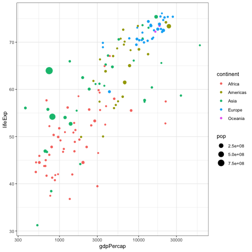
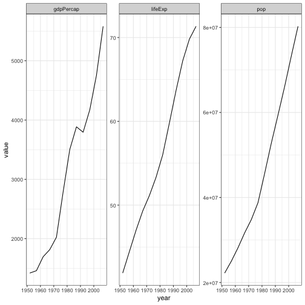
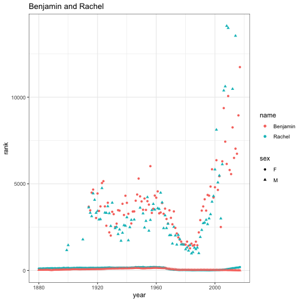

Data analysis and management using R
========================================================
author: Ben Bond-Lamberty
date: February 2019
font-family: 'Helvetica'
autosize: true

A short workshop covering reproducibility and data management; data reshaping; and summarizing and manipulation.

Virginia Commonwealth University


http://rpubs.com/bpbond/r-data-vcu


The plan
========================================================

* Reproducible research and data management (~15 minutes)
* Filtering and reshaping data (~45 minutes; the `gapminder` dataset)
* Summarizing and manipulating data (~60 minutes; the `babynames` dataset)

Feedback: <a href="mailto:bondlamberty@pnnl">bondlamberty@pnnl.gov</a> or  [@BenBondLamberty](https://twitter.com/BenBondLamberty).


Requirements
========================================================

This workshop assumes an intermediate knowledge of R.

If you want to do the hands-on exercises (encouraged!), make sure up-to-date versions of the following packages are installed:
* `dplyr`
* `tidyr`
* `gapminder`
* `babynames`

Note the first two constitute a [particular and popular dialect of R](http://tidyverse.org), but the principles we'll go over are broadly applicable.


Reproducibility and data management
========================================================
type: section


Reproducibility
========================================================

We are in the era of collaborative 'big data', but even if you work by yourself with 'little data' you have to have some skills to deal with those data.

**Most fundamentally, your results have to be reproducible.**

>Your most important collaborator is your future self. It’s important to make a workflow that you can use time and time again, and even pass on to others in such a way that you don’t have to be there to walk them through it. [Source](http://berkeleysciencereview.com/reproducible-collaborative-data-science/)


Reproducibility
========================================================

Even if you don't buy it, **prepare yourself for the future**. Funders, journals, governments, colleagues are all pushing for more reproducibility and openness. It's a slow but steady ratchet.

NSF, DOE, Wellcome, Gates, etc. are increasingly requiring data management plans; data deposition; publication in open-access journals.

Reproducibility generally means *scripts* tied to *open source software* with effective *data management* and *archiving*.


You can't reproduce
========================================================

...what you've lost. What if you need access to a file as it existed 1, 10, or 100, or 1000 days ago?
- Incremental backups (minimum)
- Don't depend on yourself! Has to be _automatic_.
- Version control. A *repository* holds files and tracks changes: what, by whom, why

***


Version control
========================================================

**Git** (and website **GitHub**) are the most popular version control tools for use with R, and many other languages:
- version control
- sharing code with collaborators in a *repository*
- issue tracking
- public or private

***


Data management during analysis
========================================================

Version control and scripts address two of the biggest problems with managing code and data: tracking *changes over time*, and understanding/reproducing *analytical steps*.

Ideally, _every_ step in your analysis is programmatic--done by a script--so it can be 'read': understood and reproduced later.


Reproducibility is a process
========================================================

*Don't let the perfect be the enemy of the good.* Upgrade and improve your workflow and skills over time.

>Organizing analyses so that they are reproducible is not easy. It requires diligence and a considerable investment of time: to learn new computational tools, and to organize and document analyses as you go.

>But partially reproducible is better than not at all reproducible. Just try to make your next paper or project better organized than the last.

A great and practical guide: http://kbroman.org/steps2rr/


Reproducible research example
========================================================

A typical project/paper directory for me, slightly idealized:
```
1-download.R
2-prepdata.R
3-analyze_data.R
4-manuscript_report.Rmd
logs/
output/
rawdata/
```

This directory contains *scripts* that are backed up both *locally* and *remotely*. It is under *version control*, so it's easy to track changes over time.

There's also [drake](https://github.com/ropensci/drake), but that's a topic for another day.


Hands-on: setting up
========================================================
type: prompt
incremental: false

If you're doing the exercises and problems, you'll need these
packages:
- `dplyr` - fast, flexible tool for working with data frames
- `tidyr` - reshaping and cleaning data
- `ggplot2` - popular package for visualizing data

We'll also use these data package:
- `babynames` - names provided to the SSA 1880-2013
- `gapminder` - life expectancy, GDP per capita, and population for 142 countries


Reshaping datasets
========================================================

In honor of the late [Hans Rosling](https://en.wikipedia.org/wiki/Hans_Rosling), we'll use the `gapminder` dataset today.


```r
library(dplyr)
library(gapminder)
gapminder
```

```
# A tibble: 1,704 x 6
   country     continent  year lifeExp      pop gdpPercap
   <fct>       <fct>     <int>   <dbl>    <int>     <dbl>
 1 Afghanistan Asia       1952    28.8  8425333      779.
 2 Afghanistan Asia       1957    30.3  9240934      821.
 3 Afghanistan Asia       1962    32.0 10267083      853.
 4 Afghanistan Asia       1967    34.0 11537966      836.
 5 Afghanistan Asia       1972    36.1 13079460      740.
 6 Afghanistan Asia       1977    38.4 14880372      786.
 7 Afghanistan Asia       1982    39.9 12881816      978.
 8 Afghanistan Asia       1987    40.8 13867957      852.
 9 Afghanistan Asia       1992    41.7 16317921      649.
10 Afghanistan Asia       1997    41.8 22227415      635.
# … with 1,694 more rows
```


Pipelines
========================================================

The `magrittr` package (used by both `dplyr` and `tidyr`) provides the `%>%` operator, which allows us to _pipe_ an object forward into a function or call expression.

Note that `x %>% f` is _usually_ equivalent to `f(x)`.


```r
print(gapminder)
gapminder %>% print
gagminder %>% head
gapminder %>% head(n=20)
gapminder %>% 
  print %>% 
  summary    # what is non-piped equivalent?
summary(print(gapminder))
```


dplyr
========================================================

The `dplyr` package uses _verbs_ (functions) to operate on _tibbles_ (data frames).


```r
some_data_frame %>% 

  do_something() %>%
  
  do_something_else() %>% 
  
  getting_dizzy_from_so_much_doing()
```

Let's go over some of those possible `do_something` steps.


filter
========================================================

Very commonly used.


```r
gapminder %>% filter(country == "Egypt")
gapminder %>% filter(country == "Egypt", year > 2000)
gapminder %>% filter(country %in% c("Egypt", "New Zealand", "Chad"))
```


filter
========================================================


```r
gapminder %>%
  filter(year == 1977) %>%
  ggplot(aes(gdpPercap, lifeExp, size = pop, color = continent)) +
  geom_point() +
  scale_x_log10()
```




select
========================================================

Also extremely useful. Note different notations for selecting columns:


```r
select(gapminder, pop, year)
gapminder %>% select(pop, year)
gapminder %>% select(-lifeExp, -gdpPercap)
gapminder %>% select(-1)
```

There are lots of other cool ways to select columns--see `?select`.


Reshaping data
========================================================
type: prompt
incremental: true

Let's focus on a single country's data for a bit. Write a pipeline that picks out Egypt data only, removes the continent and country columns, and assigns the result to a variable `Egypt`.


```r
gapminder %>% 
  filter(country == "Egypt") %>% 
  select(-continent, -country) -> 
  Egypt
```


```
# A tibble: 12 x 4
    year lifeExp      pop gdpPercap
   <int>   <dbl>    <int>     <dbl>
 1  1952    41.9 22223309     1419.
 2  1957    44.4 25009741     1459.
 3  1962    47.0 28173309     1693.
 4  1967    49.3 31681188     1815.
 5  1972    51.1 34807417     2024.
 6  1977    53.3 38783863     2785.
 7  1982    56.0 45681811     3504.
 8  1987    59.8 52799062     3885.
 9  1992    63.7 59402198     3795.
10  1997    67.2 66134291     4173.
11  2002    69.8 73312559     4755.
12  2007    71.3 80264543     5581.
```


Reshaping data
========================================================

Put this into long (or _tidy_) format--where every row is a different observation. For this we use `tidyr::gather`, which asks: what's the data source? Name of variable column (i.e. that will get old names of columns)? Name of data column? And what columns to operate on?


```r
library(tidyr)
Egypt %>% gather(variable, value, lifeExp, pop, gdpPercap)
```

```
# A tibble: 36 x 3
    year variable value
   <int> <chr>    <dbl>
 1  1952 lifeExp   41.9
 2  1957 lifeExp   44.4
 3  1962 lifeExp   47.0
 4  1967 lifeExp   49.3
 5  1972 lifeExp   51.1
 6  1977 lifeExp   53.3
 7  1982 lifeExp   56.0
 8  1987 lifeExp   59.8
 9  1992 lifeExp   63.7
10  1997 lifeExp   67.2
# … with 26 more rows
```


Reshaping data
========================================================


```r
library(ggplot2)
Egypt %>% 
  gather(variable, value, -year) %>% 
  ggplot(aes(year, value)) + geom_line() +
   facet_wrap(~variable, scales = "free")
```




Reshaping data
========================================================

Experiment. Why do these do what they do?


```r
Egypt %>% gather(variable, value, lifeExp)
Egypt %>% gather(variable, value, -lifeExp)
```

Why?


Reshaping data
========================================================

We can also spread our data out into a table form, like what you'd see in a spreadsheet, using `spread`:


```r
Egypt %>% 
  gather(variable, value, -year) %>% 
  spread(year, value)
```

`spread` is easy. It asks, 
* What goes across the new column names? 
* What's the data column to use?


Uniting, separating, mutating, and renaming
========================================================

These functions can be very useful.


```r
gapminder %>% unite(coco, country, continent)
gapminder %>% 
  unite(coco, country, continent) %>% 
  separate(coco, 
           into = c("country", "continent"), 
           sep = "_", 
           extra = "merge")
gapminder %>% mutate(logpop = log(pop))
gapminder %>% rename(population = pop)
```


Summarizing data
========================================================
type: section


Summarizing and manipulating data
========================================================

Thinking back to the typical data pipeline, we often want to summarize data by groups as an intermediate or final step. For example, for each subgroup we might want to:

* Compute mean, max, min, etc. (`n`->1)
* Compute rolling mean and other window functions (`n`->`n`)
* Fit models and extract their parameters, goodness of fit, etc.

Specific examples:

* `gapminder`: what's the year of maximum GDP for each country?
* `babynames`: what's the most common name over time?


Split-apply-combine
========================================================

These are generally known as *split-apply-combine* problems.


From https://github.com/ramnathv/rblocks/issues/8


dplyr
========================================================

The `dplyr` package specializes in data frames, but also allows you to work with remote, out-of-memory databases, using exactly the same tools, because it abstracts away *how* your data is stored.

`dplyr` is very fast for most, though not all, operations on _data frames_ (tabular data).


Verbs
========================================================

`dplyr` provides functions for each basic *verb* of data manipulation. These tend to have analogues in base R, but use a consistent, compact syntax, and are high performance.

* `filter()` - subset rows; like `base::subset()`
* `arrange()` - reorder rows; like `order()`
* `select()` - select (or drop) columns
* `mutate()` - add new columns
* `summarise()` - like base R's `aggregate`


Why use dplyr?
========================================================

Why use `dplyr`?

* Clean, concise, and consistent syntax.
* High performance in most cases.
* Same code can work with data frames or remote databases.
* Very popular; lots of help/documentation

Why not?

* Package still changing--your code might 'break'
* Programming can be trickier in some circumstances
* Not as fast in certain cases
* The `data.table` package is also worth checking out for its speed.


Grouping
========================================================

`dplyr` verbs become particularly powerful when used in conjunction with *groups* we define in the dataset. This doesn't change the data but instead groups it, ready for the next operation we perform.


```r
library(dplyr)
gapminder %>% 
  group_by(country)
```

```
# A tibble: 1,704 x 6
# Groups:   country [142]
   country     continent  year lifeExp      pop gdpPercap
   <fct>       <fct>     <int>   <dbl>    <int>     <dbl>
 1 Afghanistan Asia       1952    28.8  8425333      779.
 2 Afghanistan Asia       1957    30.3  9240934      821.
 3 Afghanistan Asia       1962    32.0 10267083      853.
 4 Afghanistan Asia       1967    34.0 11537966      836.
 5 Afghanistan Asia       1972    36.1 13079460      740.
 6 Afghanistan Asia       1977    38.4 14880372      786.
 7 Afghanistan Asia       1982    39.9 12881816      978.
 8 Afghanistan Asia       1987    40.8 13867957      852.
 9 Afghanistan Asia       1992    41.7 16317921      649.
10 Afghanistan Asia       1997    41.8 22227415      635.
# … with 1,694 more rows
```


Summarising
========================================================


```r
gapminder %>% 
  group_by(country) %>% 
  summarise(maxpop = max(pop))
```

```
# A tibble: 142 x 2
   country        maxpop
   <fct>           <dbl>
 1 Afghanistan  31889923
 2 Albania       3600523
 3 Algeria      33333216
 4 Angola       12420476
 5 Argentina    40301927
 6 Australia    20434176
 7 Austria       8199783
 8 Bahrain        708573
 9 Bangladesh  150448339
10 Belgium      10392226
# … with 132 more rows
```


Summarising
========================================================


```r
gapminder %>% 
  group_by(country) %>% 
  summarise(maxpop = max(pop))
```

```
# A tibble: 142 x 2
   country        maxpop
   <fct>           <dbl>
 1 Afghanistan  31889923
 2 Albania       3600523
 3 Algeria      33333216
 4 Angola       12420476
 5 Argentina    40301927
 6 Australia    20434176
 7 Austria       8199783
 8 Bahrain        708573
 9 Bangladesh  150448339
10 Belgium      10392226
# … with 132 more rows
```


Summarising
========================================================

We can apply a function to multiple columns, or multiple functions to a column (or both):


```r
gapminder %>% 
  select(-continent, -year) %>% 
  group_by(country) %>% 
  summarise_all(max)
```


```r
gapminder %>% 
  select(country, pop) %>% 
  group_by(country) %>% 
  summarise_all(max)
```


```r
gapminder %>% 
  group_by(country) %>% 
  summarise_if(is.numeric, max)
```


Summarising
========================================================

We can build up a long pipeline to, e.g., summarise min, mean, max for all numeric variables and end up with a table with min-mean-max as columns headers, and variable (gdpPercap, lifeExp, pop) rows.


```r
gapminder %>% 
  select(-year) %>% 
  group_by(country) %>% 
  summarise_if(is.numeric, funs(min, max, mean)) %>% 
  gather(variable, value, -country) %>% 
  separate(variable, into = c("variable", "stat")) %>% 
  spread(stat, value)
```


Introducing `babynames`
========================================================

Explore `babynames` a bit. How many rows, columns does it have? How many unique names?


```r
library(babynames)
babynames
```

```
# A tibble: 1,924,665 x 5
    year sex   name          n   prop
   <dbl> <chr> <chr>     <int>  <dbl>
 1  1880 F     Mary       7065 0.0724
 2  1880 F     Anna       2604 0.0267
 3  1880 F     Emma       2003 0.0205
 4  1880 F     Elizabeth  1939 0.0199
 5  1880 F     Minnie     1746 0.0179
 6  1880 F     Margaret   1578 0.0162
 7  1880 F     Ida        1472 0.0151
 8  1880 F     Alice      1414 0.0145
 9  1880 F     Bertha     1320 0.0135
10  1880 F     Sarah      1288 0.0132
# … with 1,924,655 more rows
```


Summarizing babynames
========================================================

What does this calculate?


```r
babynames %>%
  group_by(year, sex) %>% 
  summarise(prop = max(prop), 
            name = name[which.max(prop)])
```

```
# A tibble: 276 x 4
# Groups:   year [?]
    year sex     prop name 
   <dbl> <chr>  <dbl> <chr>
 1  1880 F     0.0724 Mary 
 2  1880 M     0.0815 John 
 3  1881 F     0.0700 Mary 
 4  1881 M     0.0810 John 
 5  1882 F     0.0704 Mary 
 6  1882 M     0.0783 John 
 7  1883 F     0.0667 Mary 
 8  1883 M     0.0791 John 
 9  1884 F     0.0670 Mary 
10  1884 M     0.0765 John 
# … with 266 more rows
```


Summarizing babynames
========================================================


https://en.wikipedia.org/wiki/Linda_(1946_song)


Hands-on: the `babynames` dataset
========================================================
type: prompt
incremental: false

Load the dataset using `library(babynames)`.

Read its help page. Look at its structure (rows, columns, summary).

Use `dplyr` to calculate the total number of names in the SSA database for each year. Hint: `n()`.

Make a graph or table showing how popular YOUR name has been over time (either its proportion, or rank).


Summarizing babynames
========================================================


```r
babynames %>% 
  filter(name == "Benjamin") %>% 
  qplot(year, n, color = sex, data = .)

babynames %>% 
  group_by(year, sex) %>% 
  mutate(rank = row_number(desc(n))) %>% 
  filter(name == "Benjamin") %>% 
  qplot(year, rank, color = sex, data = .)
```


Summarizing babynames
========================================================




Important things we didn't talk about
========================================================

- getting your data _into_ R
- working with non-text/tabular data
- lists
- joins and merges
- handling dates and timestamps
- plotting (though we had many examples)

But the tools we've covered here can do a lot!


Split-apply-combine: Max
========================================================

Compute relative growth for each treatment.


```r
tree_diameter_data %>%
  # Each day's diameter is in a separate column. Reshape
  gather(date, diameter, -treatment) %>% 
  
  # Make sure the data are in chronological order
  arrange(date) %>% 
  
  # For each tree, compute growth from beginning of the season
  group_by(tree_id) %>% 
  mutate(growth = diameter - first(diameter)) %>% 
  
  # For each treatment and species, 
  # compute average growth over all trees
  group_by(treatment, species) %>% 
  summarise(mean_growth = mean(growth)) ->
  
  tree_growth_by_trt
```


Split-apply-combine: Kayla
========================================================

How does the spatial variability of soil respiration evolve over time?


```r
licor_sr_data %>% 
  # Select the columns we're interested in
  select(date, flux, collar_number, t10, sm) %>% 
  
  # We are fundamentally interested in treatment; use a 'join'
  # to pull in that information from a table of collars/treatments
  left_join(collar_treatments, by = "collar_number") %>% 
  
  # Compute variability between collars by month and treatment
  group_by(month(date), treatment) %>% 
  summarise(spatial_variability = sd(flux) / mean(flux)) ->
  
  tree_growth_by_trt
```


Split-apply-combine: Lisa
========================================================

Calculate canopy and subcanopy assimilation for aspen in three size classes, weighting appropriately.


```r
licor_leaf_data %>%
  # We only have a tree number; pull in complete information
  left_join(tree_database, by = "tree_number") %>% 
  
  filter(species == "POGR") %>% 
  
  # Split the trees into small, medium, big
  mutate(size_class = cut(dbh, breaks = 3)) %>% 
  
  # We want to weight the computation by leaf area, which scales
  # nonlinearly with diameter
  group_by(size_class, canopy_position) %>% 
  summarise(flux = weighted.mean(flux, w = dbh ^ 2)) ->
  
  leaf_assimilation
```


Last thoughts
========================================================

>The best thing about R is that it was written by statisticians. The worst thing about R is that it was written by statisticians.
>
>-- Bow Cowgill

All the source code for this presentation is available at https://github.com/bpbond/R-data-picarro (under the `vcu` branch)

>source code for this presentation

Wait, what?

_This presentation was generated from an RMarkdown document._


Resources
========================================================
type: section


Resources
========================================================

* [CRAN](http://cran.r-project.org) - The Comprehensive R Archive Network.
* [GitHub](https://github.com/JGCRI) - The JGCRI organization page on GitHub.
* [RStudio](http://www.rstudio.com) - the integrated development environment for R. Makes many things hugely easier.
* [Advanced R](http://adv-r.had.co.nz) - the companion website for “Advanced R”, a book in Chapman & Hall’s R Series. Detailed, in depth look at many of the issues covered here.


Resources
========================================================

R has many contributed *packages* across a wide variety of scientific fields. Almost anything you want to do will have packages to support it.

[CRAN](http://cran.r-project.org) also provides "Task Views". For example:

***

- Bayesian
- Clinical Trials
- Differential Equations
- Finance
- Genetics
- HPC
- Meta-analysis
- Optimization
- [**Reproducible Research**](http://cran.r-project.org/web/views/ReproducibleResearch.html)
- Spatial Statistics
- Time Series

